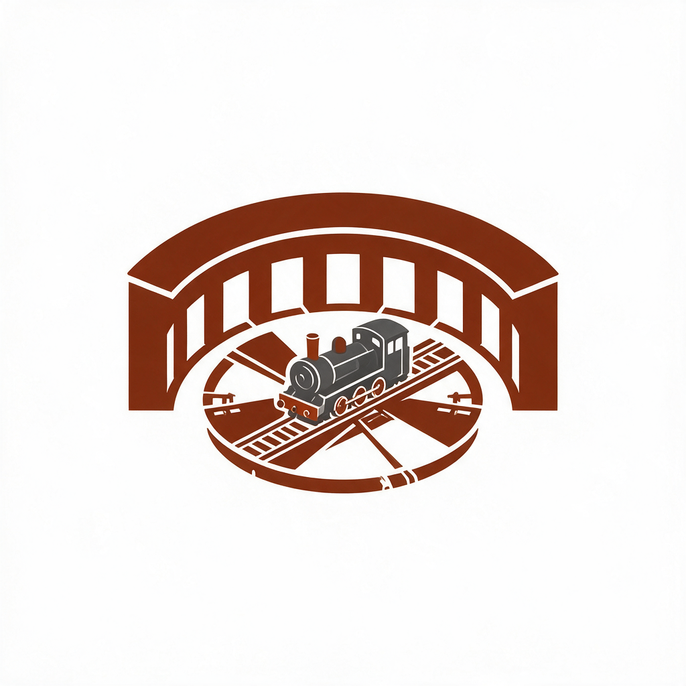
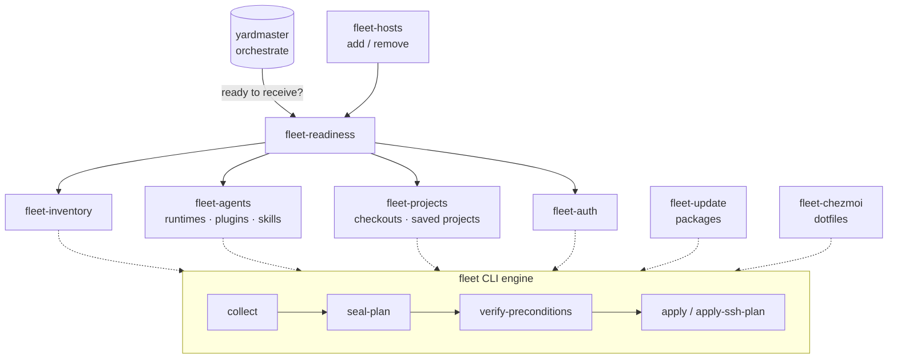
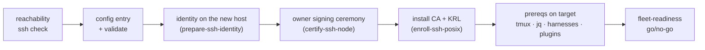

# Using Roundhouse

Roundhouse keeps a fleet of machines serviceable for AI agents. It answers,
continuously and with evidence, the questions a multi-machine setup otherwise
answers with vibes: *what's installed where, is it in sync, can I reach that
box, and is it ready to receive work?*

**What it gets you:**

- *A machine joins the fleet in one guided flow* — and leaves it just as
  cleanly, with trust actually revoked.
- *Drift can't hide.* Harness versions, plugins, skills, packages, dotfiles,
  and auth artifacts are inventoried and compared across every host.
- *Privilege stays narrow.* The few operations that need elevation go
  through signed, enrolled broker lanes — never ad-hoc sudo.
- *Dispatch stops guessing.* [Yardmaster](https://github.com/novotnyllc/yardmaster)
  consults `fleet-readiness` before placing work; unready hosts don't get
  work, they get findings.

## The mental model

Every skill fronts one shared, sealed engine: inventory feeds readiness;
mutations travel as sealed plans; transport is verified SSH (or the two
Windows lanes).

Reads are free-form; **mutations are sealed**: a plan is drafted from a
fresh inventory snapshot, sealed with digests, re-verified against current
state immediately before apply, and executed only as the exact sealed argv.
Nothing "just runs a command" on a remote machine.

## The fleet config

One file describes the fleet:
`${XDG_CONFIG_HOME:-$HOME/.config}/roundhouse/config.json` (override with
`ROUNDHOUSE_CONFIG`; hosts migrating from machine-utilities fall back to the
legacy path automatically). It names each machine — display name, SSH alias,
platform, transport, groups — plus the development root and optional
Codex remote-control and handoff-project settings. Scaffold it from the
plugin's `config.example.json`, or let `yardmaster:setup` interview you.

## Adding and removing machines

Say "add my laptop to the fleet" — `fleet-hosts` runs the whole flow, with
consent at each trust step:

Keys are generated only on the machine they identify; the CSR that travels is
public-only; the signing step is its own consented ceremony. Removal runs in
the safe order — clean up over SSH *while access still works*, then revoke
the certificate and push the updated revocation list to every remaining
host, then drop the config entry.

## Everyday operations

| You say | What runs |
| --- | --- |
| "what's on my machines?" / "any drift?" | `fleet-inventory` (read-only snapshot, human or JSONL) |
| "are the agents in sync?" / "update my plugins everywhere" | `fleet-agents` — runtime/plugin/skill parity and the routine marketplace refresh |
| "update packages on the fleet" | `fleet-update` — plan first, apply on approval |
| "did my dotfiles drift?" | `fleet-chezmoi` |
| "add/remove this machine" | `fleet-hosts` |
| "ssh to my mac is broken" | `ssh-doctor` |
| "do X on my other mac" | `remote-mac` — verified SSH, named tmux sessions for long work |
| "fix the guest network / DNS" | `unifi-network-api` |

Everything defaults to audit/report; mutations need your explicit request and
ride the sealed-plan pipeline.

## Transports

- **SSH** (macOS/Linux) — the workhorse: certificate-authenticated, bounded
  timeouts, always through the target's login shell.
- **Codex remote control** (native Windows) — a visible Codex Desktop task on
  the destination's saved project runs the verified native executor;
  interactive Windows work needs this lane.
- **`windows-sftp`** — the signed, harness-neutral lane: a four-file slot
  (request, signature, payload, commit-last) that the broker's scheduled task
  picks up within one minute. It carries declarative state — marketplace
  desired-records, profile bundles, and the narrow privileged actions — even
  to a logged-off machine, from any harness including Claude Code.

## Trust model, in one paragraph

Reads need reachability; mutations need a sealed plan and your approval;
privileged actions additionally need prior enrollment (a one-time, consented
ceremony per host) and ride signed requests validated against an enrolled
certificate — there is no general "run this as root" anywhere in the system.
Enrolled hosts keep the legacy `machine-utilities` system namespace on disk;
[AGENTS.md](../AGENTS.md) explains why and what a future re-namespacing
involves.

## With yardmaster

Roundhouse never decides or routes work. The seam is exactly two touchpoints:
`yardmaster:orchestrate` consults `fleet-readiness` before placing work on a
host, and roundhouse's own dispatch contracts require yardmaster's
`model-routing` before creating remote tasks. Install both and the seam just
works; install roundhouse alone and you still have a full fleet-administration
toolkit.
