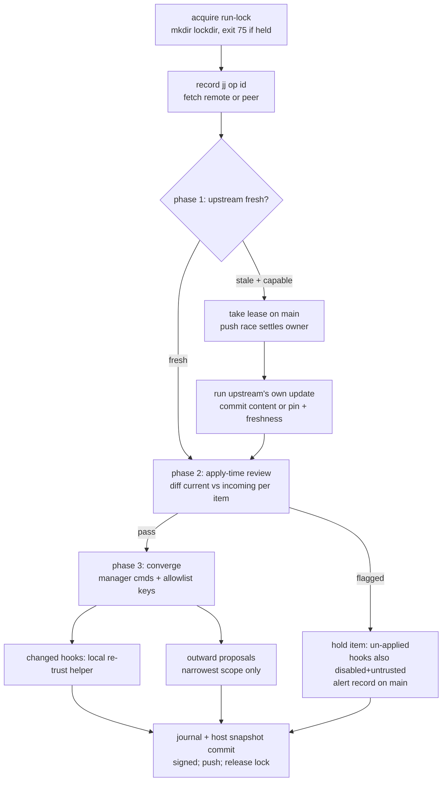

# feat: Fleet-sync store, scheduled run, and doctrine

**Target repo:** roundhouse (branch `feat/fleet-sync`)

## Summary

Implement the fleet-sync system from `docs/specs/2026-08-05-fleet-sync-design.md`
(v2, post-adversarial-review) as `sync-*` subcommands of the existing fleet CLI
plus doctrine in the fleet skills — a jj-colocated git store at
`~/.config/roundhouse/store/`, a three-phase scheduled run with apply-time
safety review on every host, allowlisted key-level config sync, hook trust
reconciliation, and the registry/scheduler/credential lifecycle around it. All
opt-in; the privilege broker is untouched. Verified by fixture-driven
extensions to `scripts/test-roundhouse`.

---

## Problem Frame

Five machines × two harnesses drift: plugins, skills, hooks, MCP servers, and
config keys change on one host and rot on the others. The spec defines an
opt-in desired-state sync with per-host history and evidence-based conflict
resolution. The adversarial review hardened it (apply-time review, logs out of
store, key-level config sync, scoped proposals); this plan turns the v2 spec
into roundhouse machinery and doctrine. The spec is the requirements source of
truth; where this plan and the spec disagree, the spec wins.

---

## Requirements

Traceability is to spec sections (the spec has no R-IDs; IDs assigned here).

- **R1** Store: jj-colocated git repo at `~/.config/roundhouse/store/`
  (Windows: `%USERPROFILE%\.config\roundhouse\store\`), curated tracking,
  size tripwire, `main` + `host/<name>` branches, conflicted items held
  (never materialized), git-only degraded mode per host. [spec: The store]
- **R2** Trust: signed commits over the fleet SSH CA, verified before apply;
  per-host minimal credentials with enrollment/revocation lifecycle; store
  treated as trusted-write surface. [spec: Threat model]
- **R3** Registry authority: store absorbs `config.json`'s `machines` at
  enrollment; per-host `config.json` generated from the store afterward;
  `identity.json` never enters. [spec: The store]
- **R4** Scheduled run: one owned scheduler entry per host (absorbs
  fleet-update's autoupdate entry, doctrine-level), local run-lock, three
  phases — leased upstream update; apply-time safety review on every host for
  every changed item; converge with narrowest-scope outward proposals.
  iris-windows runs interactive-session-only; staleness is named by doctor.
  [spec: The scheduled run]
- **R5** Config sync is key-level via allowlists (the `agent_artifacts.settings`
  shape); whole files never canonical; host-local namespaces excluded.
  [spec: Surface and provenance]
- **R6** Enabled/disabled state syncs for every item type carrying it; hook
  enablement syncs while trust hashes stay host-local, reconciled by:
  review-pass ⇒ local re-trust via the approval helper; held ⇒ disabled AND
  untrusted. [spec: Surface and provenance]
- **R7** Session transcripts never enter the store; mining is local; only
  redacted finding records replicate. [spec: Sensitive data]
- **R8** Intent resolution: history → provenance → redacted findings;
  confident applies at evidenced scope; ambiguous holds and alerts.
  [spec: Intent resolution]
- **R9** Rollback: per-run undo via jj op log (pre-push); restore is
  "configs + shopping list" in the spec's sequence. [spec: Rollback]
- **R10** Alerts are records on main + journal lines + native notification
  where a user is present; any interactive session surfaces fleet-wide
  pending items; doctor is the scheduled backstop with the spec's check
  list (including per-host last-sync staleness and enabled-but-untrusted
  hooks). [spec: Alerting / Setup and doctor]
- **R11** Opt-in at every layer; nothing activates without explicit setup
  consent. [spec: Purpose]

---

## Key Technical Decisions

- **KTD1** Session transcripts/logs never enter the store; local mining,
  redacted findings only. (session-settled: user-approved — chosen over
  rotating raw logs onto host branches: raw replication to a hosted remote is
  a privacy incident, wedges snapshots, grows the repo unboundedly.)
- **KTD2** Safety review runs at apply time on every host for every changed
  item. (session-settled: user-approved — chosen over fetch-time-only review:
  store compromise would otherwise be unreviewed fleet-wide code injection.)
- **KTD3** Store lives in the `store/` subdirectory; store registry is
  authoritative after enrollment. (session-settled: user-approved — chosen
  over a jj repo at the config root: the root holds live host-local files.)
- **KTD4** Key-level allowlisted config sync. (session-settled: user-approved
  — chosen over whole-file materialization: secrets, host-local namespaces,
  manager CLIs write the same files.)
- **KTD5** Opt-in only. (session-settled: user-directed — chosen over
  default-on: enabling is always an explicit choice.)
- **KTD6** One scheduler entry per host owned by sync, absorbing fleet-update's
  autoupdate entry; local run-lock. (session-settled: user-approved — chosen
  over separate schedulers: two local runners race one plugin cache.)
  Research note: absorption is doctrine-only — no plist-installing code
  exists in this repo; the entry is installed by railyard:setup per doctrine.
- **KTD7** jj operates the store with a git-only degraded mode.
  (session-settled: user-approved — chosen over hard jj requirement: Windows
  maturity unproven; safety never depends on jj.) Floor jj 0.43 (loose-object
  corruption fix; push-skips-conflicted-bookmarks semantics since 0.41).
- **KTD8** Hook trust reconciliation: review-pass is the approval evidence,
  then the local helper re-trusts; held changes stay disabled and untrusted.
  (session-settled: user-approved — chosen over syncing trust tables:
  the store must never become a trust channel.) The primitive exists:
  `roundhouse approve-codex-plugin-hooks` / `codex-plugin-hooks.mjs`.
- **KTD9** Privilege broker untouched in this lane. (session-settled:
  user-directed — chosen over one combined change: the sibling spec consumes
  this lane's journals; bounded review surfaces.)
- **KTD10** Sync verbs are subcommands of the existing `roundhouse` CLI, not a
  new standalone script — dispatch, config resolution, jq, `safe_output`,
  `ssh_run`, and integrity coverage come free; the enroll-style hardened-env
  pattern is not needed because sync never runs privileged. (Research-driven;
  rejected: new standalone hardened script — costs update-integrity/CI/self-test
  wiring for no privilege boundary.)
- **KTD11** Curated tracking = `snapshot.auto-track = "none()"` per-repo plus
  explicit `jj file track`, with `.gitignore` as backstop;
  `snapshot.max-new-file-size` kept small as an accident tripwire — but since
  jj 0.25 oversize is warn-and-leave-untracked, the run must check for
  unexpectedly-untracked files rather than catch an error. No symlinks in the
  store (Windows constraint).
- **KTD12** Conflict detection is mechanical via jj: `conflicts()` revset /
  `jj bookmark list --conflicted` with `-T` templates, `--ignore-working-copy`,
  `ui.paginate=never`; jj pushes already skip conflicted bookmarks (0.41+), so
  the remote never carries conflicts. Git-only hosts: divergence detected via
  fetch + merge-base; conflicted items held-and-alerted without merging.
- **KTD13** Signing: git-style SSH commit signing (jj `signing.backend="ssh"`,
  `behavior="own"`; git-only hosts use plain git signing config), verified
  with `ssh-keygen -Y verify`/`git verify-commit` against an allowed_signers
  file derived from the fleet CA enrollment. Trust roots and lifecycle
  (enroll/revoke/KRL) already exist in `certify-ssh-node`/`enroll-ssh-posix`.
- **KTD14** Run-lock uses the repo's mkdir-lockdir convention (exit 75), not
  flock. Record schemas are jq-built objects with `schema` fields
  (`roundhouse.sync-journal`, `roundhouse.sync-alert`, `roundhouse.sync-finding`),
  matching existing `roundhouse.*` schema style.
- **KTD15** iris-windows sync drives through the existing WSL interop lane:
  the `wsl_interop_via` sibling operates the Windows store (git-only mode) at
  the `/mnt/c` mapping of `%USERPROFILE%\.config\roundhouse\store\`. No
  PowerShell port in this lane. (Review-resolved per established doctrine —
  WSL is the launcher; rejected: bash-in-native-Windows, which has no lane in
  this repo, and a PowerShell twin, which doubles the surface for one host.)
- **KTD16** The allowed_signers file is host-local, derived from the fleet CA
  enrollment lifecycle (`certify-ssh-node`/`enroll-ssh-posix`, including KRL
  revocation) — never read or materialized from store content. A
  store-carried signer file would let a store compromise become
  self-verifying. (Security-review-driven; extends KTD8's no-trust-channel
  rule to signer material.)

---

## High-Level Technical Design

### Store layout (main branch)

```text
store/
  registry/machines/<name>.json      # absorbed authoritative registry
  registry/groups/<name>.json
  desired/<scope>/<item-type>/<id>.json   # desired entries w/ enabled state
  allowlists/<config-file-id>.json   # synced key sets + excluded namespaces
  upstreams/<id>.json                # freshness records
  leases/<upstream-id>.json          # short-TTL update leases
  alerts/<id>.json                   # pending fleet-wide items
  findings/<host>/<id>.json          # redacted transcript findings
  canary/<tuple-digest>.json         # journaled canary results (lane-2 seam)
```

`host/<name>` branch adds: `snapshot/` (inventory), `journal/` (runs),
`materialized/` (config-key state as applied). No secrets, no identity files,
no transcripts anywhere.

### Three-phase run (sync-run driver)



Conflicted items short-circuit before phase 2: an item whose path is
conflicted on main (jj `conflicts()`; git-only: unresolved divergence)
converges from its last conflict-free state and is held item-level.

---

## Implementation Units

### U1. Registry schema and sync config

**Goal:** The config schema carries sync: store path override, remote spec,
cadence, enabled flag, canary group ref; `validate_config_file` validates the
new block explicitly (it tolerates unknown keys silently — extension must be
deliberate).
**Requirements:** R3, R11. **Dependencies:** none.
**Files:** `plugins/roundhouse/scripts/roundhouse` (validate predicate),
`plugins/roundhouse/config.example.json`.
**Approach:** Add optional top-level `sync` object (exact key-set check like
`privilege_broker`'s) and per-machine `sync` overrides; absent block = sync
not configured (opt-in). Cross-platform store path resolution mirrors
`config_path()` (`ROUNDHOUSE_SYNC_STORE` env override for tests). Per KTD15,
the Windows store path is operated from the WSL sibling via `/mnt/c` — path
resolution never needs to run in native-Windows bash.
**Test scenarios:**
- Valid config with full sync block passes `validate-config`.
- Misspelled key inside `sync` fails validation (exact key-set).
- Config without sync block still passes (opt-in).
**Verification:** `validate-config` fixtures in self-check.

### U2. Store scaffold and status (`sync-init`, `sync-status`)

**Goal:** `roundhouse sync-init` scaffolds the store; `sync-status` reports
mode/health machine-readably.
**Requirements:** R1, R2, R11. **Dependencies:** U1.
**Files:** `plugins/roundhouse/scripts/roundhouse`.
**Approach:**
1. Detect jj ≥ 0.43 → colocated init (`jj git init --colocate`), set repo
   config: `snapshot.auto-track="none()"`, `snapshot.max-new-file-size`,
   `ui.paginate="never"`, signing (`backend="ssh"`, `behavior="own"`, key +
   allowed_signers path); else git-only mode recorded in store meta. The
   allowed_signers file is host-local per KTD16 (derived from CA enrollment,
   never from store content).
2. Write curated `.gitignore`, directory skeleton, branch layout (`main`,
   `host/<hostname>`), remote per config. `sync-init` records a
   remote-visibility verification result in store meta (API-verified private,
   per spec); the first push (U4) refuses when it is absent.
3. `sync-status`: mode (jj|git-only), remote reachability, last sync, lock
   state, conflicted items, unexpectedly-untracked files (the KTD11 tripwire) —
   JSON via `safe_output`; never prints credential material when reporting
   the remote.
**Patterns:** `*_command()` + case dispatch; `mktemp` + trap; sysexits.
**Test scenarios:**
- Init with fake `jj` bin creates colocated layout and repo config calls.
- Init without jj falls back to git-only and records the mode.
- Re-init is idempotent (exit 0, no destructive reset).
- Status reports lock held (75-convention), conflicted item, untracked-file
  tripwire from fixtures.
- A commit signed by a key present only in a store-carried signer file
  refuses verification (KTD16).
**Verification:** fixture-driven self-check block (fake jj/git bins, tmp XDG).

### U3. Registry absorption and per-host config generation

**Goal:** `sync-absorb-registry` moves `config.json.machines` into
file-per-machine records on main; `sync-render-config` generates a host's
`config.json` from the store (host-local values rendered per host), passing
the strict validator.
**Requirements:** R3. **Dependencies:** U2.
**Files:** `plugins/roundhouse/scripts/roundhouse`.
**Approach:** Absorption is one-way and enrollment-time; rendered config must
byte-stably round-trip (jq -S) and keep non-world-writable mode
(`check-mutation-config` compatibility). `identity.json` explicitly ignored.
`sync-render-config` verifies the store state it reads (signed by an enrolled
key, same allowed_signers mechanism as U5) before generating `config.json` —
registry-driven config generation is an apply of fleet-writable content and
gets the same gate.
**Test scenarios:**
- Absorb splits example config into per-machine files; groups preserved.
- Rendered config passes `validate-config` and equals semantic round-trip.
- Render for host A marks A's entry `transport: local`; B's stays ssh.
- Rendered file mode is 600.
- Render from unsigned or wrong-signer store state refuses.
**Verification:** self-check comparing absorbed→rendered round-trip.

### U4. Run driver: lock, lease, phases, journal, undo (`sync-run`)

**Goal:** The three-phase run as a driver command with run-lock, op-id
capture (jj mode) for pre-push undo, lease take/settle on main, freshness
records, conflicted-item hold, signed journal/snapshot commits, push (jj push
skips conflicted bookmarks by design; git-only pushes only clean state).
**Requirements:** R4, R8, R9. **Dependencies:** U2, U3.
**Files:** `plugins/roundhouse/scripts/roundhouse`.
**Approach:** `sync-run` orchestrates but delegates judgment: phase 2 review
and phase 3 convergence decisions are emitted as work items for the calling
agent (the skill doctrine drives an agent through them); the CLI provides
deterministic mechanics (diff extraction, hold records, journal writes,
lease CAS via push race). This keeps LLM judgment out of bash and matches
the collect→seal→apply house pattern. Sub-commands: `sync-fetch`,
`sync-lease`, `sync-diff <item>`, `sync-hold <item>`, `sync-journal`,
`sync-undo <op-id>`.
Undo semantics (review-corrected): the push *marker* is set only by the
end-of-run journal/snapshot push. Phase-1 lease/freshness pushes are recorded
separately and never trip the marker — otherwise every leased run would be
un-undoable before it materialized anything. `sync-undo` restores post-lease
local operations (materialization, journal-in-progress) via jj `op restore`
and never retracts pushed store commits; on git-only hosts it refuses with a
machine-readable reason directing the operator to the restore flow (jj is
never load-bearing for safety, so degraded mode gets an honest refusal, not
a reflog approximation).
Peer-fetch fallback: `sync-fetch` tries registry-derived peer remotes (SSH
alias + store path from the machine registry) when the primary remote is
unreachable.
Self-update ordering (spec containment rule): the driver updates the
roundhouse plugin *last*, on the lease-holding host only; other hosts refuse
to adopt a new roundhouse pin until the updating host's subsequent run has
journaled healthy in the store.
First push refuses when U2's remote-visibility verification is absent from
store meta.
**Test scenarios:**
- Second concurrent run exits 75 (lockdir held).
- Lease race: two writers, one wins on push, loser's re-fetch sees winner
  (simulated with local bare remote fixture).
- Conflicted path on main → item held, run continues, alert record written.
- `sync-undo` restores post-lease local ops (fake jj records `op restore`)
  and refuses after the end-of-run push marker exists; a run that took a
  lease (phase-1 push) is still undoable for its phase-3 local changes.
- `sync-undo` in git-only mode refuses with the machine-readable
  restore-flow reason.
- Peer fetch: primary remote unreachable → fetch succeeds from a second
  bare "peer" remote fixture.
- A new roundhouse pin without a healthy-journal marker from the updating
  host is not adopted on a second host.
- First push without remote-visibility verification in store meta refuses.
- Journal record carries schema `roundhouse.sync-journal` and run outcome.
**Verification:** bare-remote + fake-jj fixtures in self-check; no network.

### U5. Apply-time review mechanics and hook trust reconciliation

**Goal:** Deterministic diff/hold/apply mechanics for phase 2, and the hook
path: store-delivered hook change + review pass ⇒ invoke the local approval
helper; flagged ⇒ hook disabled AND untrusted plus alert; doctor-visible
`enabled-but-untrusted` detection in `sync-status`.
**Requirements:** R2, R6. **Dependencies:** U4.
**Files:** `plugins/roundhouse/scripts/roundhouse` (mechanics), doctrine in
U8 (the review rubric itself is agent judgment, per KTD/spec).
**Approach:** `sync-diff` emits current-vs-incoming per item (text surfaces);
`sync-apply <item>` materializes only after a recorded review verdict
(`sync-verdict <item> pass|hold <reason>`); hook items route through
`approve-codex-plugin-hooks` on pass and enablement-off on hold. Signature
verification (`git verify-commit` / `ssh-keygen -Y verify` against the
host-local allowed_signers per KTD16, consulting the CA revocation list so
revocations bite at verify time) gates every apply.
Verdict-content binding (review-corrected): `sync-verdict` records the
content digest (store commit id) of the diff actually reviewed;
`sync-apply` recomputes and refuses on mismatch — a verdict never authorizes
newer content than it reviewed.
Allowlist files under `allowlists/` are themselves phase-2 reviewed items: a
changed allowlist is diffed and verdict-gated before any materialization
uses it.
**Test scenarios:**
- Apply without verdict refuses (fail closed).
- Verdict recorded, incoming item content changed since → apply refuses
  (digest mismatch).
- Hold on a hook writes disabled state and never calls the approve helper.
- Pass on a hook calls the approve helper (fake node/mjs records call).
- Unsigned or wrong-signer incoming commit refuses apply; a KRL-revoked
  signer refuses.
- An allowlist expanded to cover an excluded/secret namespace is held at
  review, not materialized.
- Allowlisted-key materialization only touches allowlisted keys (see U6).
**Verification:** fixture hooks.json + fake helper in self-check.

### U6. Allowlist config materialization and scoped proposals

**Goal:** Key-level config sync: `sync-materialize <config-id>` applies only
allowlisted keys (jq merge) preserving host-local namespaces; outward
changes become `sync-propose` records at narrowest scope (single machine).
**Requirements:** R5, R4-converge, R8. **Dependencies:** U4.
**Files:** `plugins/roundhouse/scripts/roundhouse`.
**Approach:** Allowlists live on main (`allowlists/`), shaped like
`agent_artifacts.settings`; materialization computes the key-intersection
patch and writes via `safe_output` semantics to the target file (600 mode);
excluded-namespace keys are provably untouched, and the exclusion list takes
precedence over allowlist membership at materialize time (an allowlisted key
that intersects an exclusion refuses). `sync-materialize` carries the same
fail-closed gate as U5's `sync-apply`: signature verification plus a
recorded, digest-bound pass verdict for the config item — it is not an
independently callable unreviewed write path. Proposals record item,
host, evidence pointer, scope=machine; widening is an intent-resolution
outcome recorded separately (mechanics only; judgment is doctrine).
**Test scenarios:**
- Materialize changes allowlisted key, preserves non-allowlisted sibling and
  unknown host-local namespace byte-for-byte.
- Materialize without a verdict, or from unsigned/wrong-signer store state,
  refuses (same gate as apply).
- Materialize refuses a key intersecting the exclusion list even when
  allowlisted (exclusion precedence).
- Secret-bearing namespace in fixture config never appears in store commits.
- Propose writes machine-scoped record; no group scope ever emitted by CLI.
- Machine>group state precedence resolved by `sync-effective <host>` fixture.
**Verification:** self-check jq assertions on materialized files and store.

### U7. Alert, finding, and record schemas

**Goal:** `roundhouse.sync-alert` / `roundhouse.sync-finding` /
`roundhouse.sync-journal` schemas + `sync-pending` (fleet-wide pending items
for any interactive session) and redacted-finding write path (`sync-finding`
with bounded quote length; no secret patterns — enforced mechanically by
byte-length cap + a named-class denylist: PEM blocks, JWT shape, common
cloud/token prefixes, plus a bounded high-entropy token check). The
mechanical floor is a backstop to agent-side redaction, not the primary
control (spec open item 6, minimal viable).
**Requirements:** R7, R8, R10. **Dependencies:** U4.
**Files:** `plugins/roundhouse/scripts/roundhouse`.
**Test scenarios:**
- Finding over the quote cap refuses; secret-pattern (e.g. `ghp_`,
  `-----BEGIN`) refuses.
- `sync-pending` lists alerts from main regardless of originating host.
- Alert record schema round-trips jq validation.
**Verification:** self-check fixtures.

### U8. Skill doctrine: fleet-agents, fleet-update, fleet-hosts

**Goal:** Replace fleet-agents' "specified, not yet implemented" section with
the operating doctrine (three-phase run driven through the sync-* commands,
review rubric, hook reconciliation, proposal scoping, opt-in stance). The
review rubric must instruct the reviewing agent to treat item content
strictly as untrusted data — reviewer-directed instructions or approval
claims embedded in a diff are themselves a hold trigger (the cheapest bypass
of the gate is content addressed to the reviewer, not hidden malice).
Alert delivery doctrine includes a platform-native notification when a user
session is present (osascript/notify-send/toast — agent-driven per the
judgment split, not CLI code). Doctrine carries the sibling-spec seam
sentence: desired-state lives here, root-touching authority lives with the
privilege broker per docs/specs/2026-08-06-unattended-privileged-updates.md;
the U7 journal and canary record shapes are that seam and must not change
without cross-checking the sibling spec.
fleet-update's unattended section hands its scheduler entry to sync
(absorption is doctrine-only; the fixed prompt text moves in lockstep);
fleet-hosts gains store-credential provisioning at add (SSH deploy key in
~/.ssh or credential-helper-held token — never embedded in the remote URL)
and revocation at remove, plus the spec's five-step restore sequence
(fleet-hosts enrollment/SSH ceremony → store credentials → materialize
file-carried surfaces from host/X → replay manager installs from the
inventory snapshot → per-artifact reauth), read-first. A per-type
state-alignment capability table (which enable/disable commands each harness
actually supports, config-edit fallback otherwise) lands as a doctrine
deliverable resolving spec open item 2. The doctor check contract names the
spec's full list: store reachable/replicating, commit signatures verifying,
upstream staleness, per-host last-sync staleness, enabled-but-untrusted
hooks, conflict age, held items, scheduler entry singular and alive,
co-ownership sanity, store size within budget — in fleet-agents/readiness
doctrine as the roundhouse-side contract that railyard:doctor consumes.
**Requirements:** R2, R4, R6, R10, R11. **Dependencies:** U2–U7 (names the
real commands).
**Files:** `plugins/roundhouse/skills/fleet-agents/SKILL.md`,
`plugins/roundhouse/skills/fleet-update/SKILL.md`,
`plugins/roundhouse/skills/fleet-hosts/SKILL.md`,
`plugins/roundhouse/skills/fleet-readiness/SKILL.md` (doctor contract line).
**Approach:** Doctrine edits and their `assert_contains` pins in
`scripts/test-roundhouse` land in the same commit (house rule — the
self-check grep-pins exact phrasing; budget the churn: existing pins that
quote the replaced fleet-agents section and fleet-update's scheduled prompt
must be updated together).
**Test scenarios:** new doctrine pins (sync commands named, opt-in stance,
hook-hold wording, scheduler-absorption sentence, untrusted-data/injection
hold-trigger wording, native-notification line, restore-sequence steps,
credential-storage-form line, doctor full check list, sibling-seam
sentence); updated pins for replaced text; ordering asserts where sequence
matters.
**Verification:** self-check PASS is the gate.

### U9. Self-check extensions (consolidating gate)

**Goal:** One sync fixture block in `scripts/test-roundhouse` covering the
scenarios enumerated in U1–U7 plus the doctrine pins from U8 — fake `jj`,
fake `git` remote (local bare repo), fake approve-helper, tmp
`XDG_CONFIG_HOME`, `ROUNDHOUSE_SYNC_STORE` override; no network, no real jj
dependency in CI.
**Requirements:** all. **Dependencies:** U1–U8.
**Files:** `plugins/roundhouse/scripts/test-roundhouse`,
`.github/workflows/validate.yml` only if a new standalone file is added
(none planned per KTD10).
**Test scenarios:** as enumerated per unit; the block follows the fake-bin +
scenario-env house pattern. Additionally an **optional real-jj block** —
skipped with a visible notice when jj ≥ 0.43 is not on PATH — drives two
working copies against a local bare remote through the lease race, the
conflicted-bookmark push skip, and op-restore: the fake-bin fixtures verify
the driver's logic against scripted assumptions, and only real jj can
falsify those assumptions about push-rejection and conflict semantics.
**Verification:** `./scripts/test-roundhouse` exits 0 printing PASS; the
real-jj block must have passed at least once on the jj-equipped dev machine
before merge (recorded in the PR).

### U10. Version, integrity, release refs

**Goal:** Bump both plugin.json versions (0.3.5 → 0.4.0 — new feature
surface), update the two grep-pinned hardcoded version refs
(`skills/fleet-agents/SKILL.md`, `references/codex-remote-control.md`), run
`scripts/update-integrity`, confirm integrity diff-clean per CI.
**Requirements:** release coupling. **Dependencies:** U1–U9.
**Files:** `plugins/roundhouse/.claude-plugin/plugin.json`,
`plugins/roundhouse/.codex-plugin/plugin.json`, the two ref files,
`plugins/roundhouse/integrity.json`.
**Test expectation: none** — covered by existing self-check version asserts
and CI integrity gate.

---

## Scope Boundaries

### Deferred to Follow-Up Work
- **railyard setup/doctor edits** (scheduler-entry installation, opt-in pitch,
  doctor check consumption, store-credential prompts) — different repo;
  executed as a small follow-on PR after this lane merges, consuming the
  command contract U8 defines.
- **Canary gating consumption** — the `canary/` record layout ships here as
  the seam; the gating logic belongs to the privileged-updates lane (KTD9).
- **Codex marketplace auto-update research** (spec open item 1) — deferred;
  phase 1 treats Codex like Claude (drive updates explicitly).
- **Transcript-mining agent doctrine beyond the finding-record mechanics** —
  U7 ships the write path with mechanical redaction floors; the mining
  procedure itself is doctrine iterated post-merge.
- **Phase-0 capability-check execution** (spec open item 2) — U8 ships the
  doctrine deliverable (the per-type command table + config-edit fallback);
  populating it per harness version and automating the check is follow-up.
- **Store credential provisioning automation** — fleet-hosts doctrine names
  the manual step (create token/deploy key per host); automating issuance is
  future work.

### Outside scope
- Privilege broker changes of any kind (lane 2).
- Any default-on behavior; any secret or transcript in the store.
- History-compaction tooling (spec open item 7 — documented as
  incident-class, not built).

---

## Risks & Dependencies

- **Doctrine-pin churn** is the top schedule risk: 137 existing
  `assert_contains` pins; every doctrine edit must update pins in the same
  commit or self-check fails. Mitigation: U8+U9 are one combined commit
  scope; grep for quoted phrases before editing.
- **jj absence in CI**: CI runners won't have jj — all self-check coverage
  uses fake bins (U9); real-jj behavior is validated post-merge on this Mac
  (jj 0.43 via brew) as the supervised first run.
- **validate_config_file strictness**: rendered configs must keep passing the
  ~300-line predicate; U3 round-trip tests gate this.
- **Spec drift both ways**: doctrine written here must not contradict the
  sibling privileged-updates spec's seam (desired-state vs authority split);
  U8 carries the cross-reference sentence.

---

## Verification Contract

- `./scripts/test-roundhouse` (from `plugins/roundhouse/`) exits 0 — includes
  all new sync fixtures and doctrine pins.
- `scripts/update-integrity` leaves `integrity.json` diff-clean.
- CI matrix (ubuntu, macos shellcheck/bash -n, Windows integrity job)
  green on the PR.
- Post-merge proof: self-check PASS on main after merge.

## Definition of Done

All units landed on `feat/fleet-sync`; self-check and CI green; PR merged to
main with post-merge self-check PASS; deferred items recorded above; version
0.4.0 with integrity regenerated. Marketplace publish and fleet rollout are
the delivery tail outside this plan (owned by the invoking pipeline).

---

## Sources & Research

- Spec (source of truth): `docs/specs/2026-08-05-fleet-sync-design.md`
- Sibling seam: `docs/specs/2026-08-06-unattended-privileged-updates.md`
- Repo research (2026-08-06): CLI/test/integrity conventions, scheduler
  absorption is doctrine-only, hook-approve primitive exists, mkdir-lockdir
  convention, CA lifecycle reusable for signing.
- jj research (2026-08-06, docs.jj-vcs.dev, v0.43): colocated init, conflicts()
  revset, push-skips-conflicted (0.41+), op restore semantics,
  auto-track none(), max-new-file-size warn-not-error (0.25+), native SSH
  signing git-verifiable, winget/scoop packaged, no `/`-target symlinks on
  Windows.
