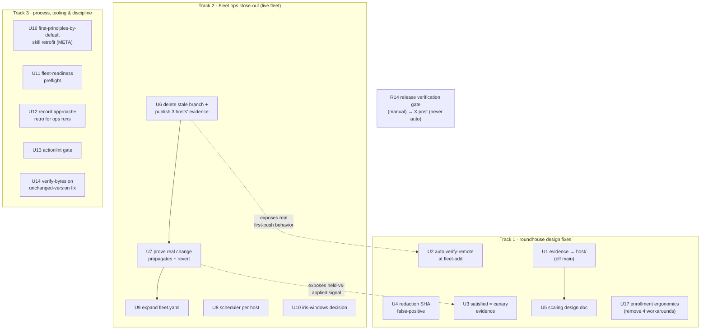

# feat: Fleet DSC hardening + 0.6.0 release close-out

**Target repos:** primarily `novotnyllc/roundhouse` (design fixes + process); operational units act on the live `fleet-store.git` and the 5 fleet hosts; the release gate touches `novotnyllc/railyard`. Repo-relative paths below are roundhouse-relative unless labeled machine-local or another repo.

## Summary

The novotnyllc 0.6.0 release shipped (railyard `c631df7`, roundhouse `8e765ed`, marketplace `1325fc2`, all CI-green) and the roundhouse DSC fleet was stood up for the first time (4 hosts enrolled, all 5 hosts updated on both harnesses). Standing it up surfaced **five roundhouse design issues**, left **six operational close-out tasks**, produced **process/tooling learnings**, and exposed one **engineering-discipline meta-finding** — the most important of the lot. This plan makes those executable from a fresh chat. It does **not** re-do completed work; it hardens what the bring-up exposed and closes the release. The X launch post remains gated on the user's manual verification and is tracked here, not automated.

**The meta-finding, stated plainly (see U16):** first-principles engineering judgment did **not** fire by default this run. The fleet store was treated as a delicate "v1→v2 migration" for hours — production-migration caution applied to state nobody used — until the user forced the correction ("there is no v1, no v2, no one is using this — make it work"). The same reflex gap shows up in reactive execution (scope grew multi-host/multi-repo with no plan artifact until asked) and in overriding a safety guard (a raw git push past the redaction sweep). These are not one-off mistakes; they are a *default-behavior* gap the skills should close so the judgment fires without a reminder. This is the standing thread behind memories `skills-assume-engineering-fundamentals` and `fleet-dsc-landmark-build` (retrofit this build's learnings into the skills after the release ships).

This is a decision artifact, not a work order — every unit is grounded in code the author read this session, cited by `file:line`. Design fixes (Track 1) change roundhouse behavior around a signed, every-machine-reads-it store; treat them as high-risk and land each with the store's own test suite green.

---

## Problem Frame

The DSC fleet was never actually operational before this session (dead v0.5 store, no roster, no toolchain, no `roundhouse` on PATH). Rebuilding and enrolling it end-to-end exposed correctness and scaling gaps that only appear once more than one host participates:

- Host-specific evidence lands on the shared `main` line instead of per-host branches.
- New hosts can't publish until a manual per-host gate is run — nothing runs it.
- Already-satisfied desired state never emits canary evidence, so downstream hosts wait forever.
- A publish guard false-positives on ordinary git SHAs.
- The single-repo-holds-all-evidence-forever shape does not scale past a few tens of nodes.

Separately, the release itself needs its verification tail closed, and the run that produced all this left no audit spine — a process gap worth fixing so the next fleet run is legible.

---

## Requirements

Traceable to the session audit + user-dictated three-track scope.

- **R1** — Fleet-store `main` carries only host-agnostic state (desired-state layers + trust); every host's convergence evidence (journal/materialized/applied) lives on `host/<name>`, hub included.
- **R2** — A newly `fleet-add`'d host can publish its evidence on its first `fleet-run` with no manual verify-remote step.
- **R3** — When the canary already satisfies a desired item, downstream hosts converge rather than waiting forever for `applied` evidence that will never come.
- **R4** — The publish redaction sweep does not flag a bare 40-hex git SHA in a commit/checkpoint description as a secret.
- **R5** — There is a documented, evidenced DSC scaling design (compaction/TTL, sharding, aggregate index) that names the breakpoints and the chosen mitigations; implementation is scoped, not necessarily executed in this plan.
- **R6** — The three enrolled hosts (iris-wsl, mac-mini, mac-studio) have published `host/<name>` branches on the remote; the stale v0.5 `host/macbook-pro` branch is gone.
- **R7** — A real desired-state change is proven to propagate canary → downstream and then be reverted, leaving the fleet at its prior state.
- **R8** — Each host runs `fleet-run` unattended on a single owned scheduler entry.
- **R9** — `fleet.yaml` desired state is expanded past railyard+roundhouse to the intended managed set (skills/other plugins), or the intended set is explicitly recorded.
- **R10** — iris-windows DSC membership is decided (separate member vs. covered by its WSL sibling) and the decision is recorded.
- **R11** — A fleet-wide operation runs a readiness preflight first (jj/yq, `roundhouse` on PATH, SSH-name resolvability, verified-private remote) so prerequisites surface at once.
- **R12** — A substantial ops/release run records an `approach` line and a retrospective, not only deliver/orchestrate runs.
- **R13** — Workflow YAML is lint-gated (`actionlint`) before it can reach `main`.
- **R14** — The release verification gate is tracked to completion: plugins reload at 0.6.0, live routing behavior, `railyard:deliver` end-to-end, Codex Desktop on iris-windows post-swap, and a fresh (clean, not update-path) marketplace install producing working plugins — then and only then the X post is unblocked (manual, never auto).
- **R15** — The session's engineering-discipline learnings are retrofitted into the relevant skills so the judgment fires *by default*, not on reminder: (a) greenfield/unused state is disposable — confirm "who depends on this?" before applying production caution; (b) when scope crosses a threshold (multi-host, multi-repo, hours), produce a plan artifact instead of executing reactively; (c) never override a safety guard (e.g. a raw push past the redaction sweep) — fix the false-positive or use the sanctioned path; (d) verify installed bytes, not the version string, when a fix ships under an unchanged version; (e) **completeness reflex** — build any plan/handoff/retrospective by sweeping the *primary record* (the full run) and mapping every flagged item + every mid-run workaround to captured/not-captured, never by re-summarizing a summary you already wrote; a workaround (shim, alias, hand-edit) is a deferred defect to capture, not a closed item. This closes the standing follow-up in memories `skills-assume-engineering-fundamentals` and `fleet-dsc-landmark-build`.
- **R16** — Fleet bootstrap/enrollment is self-sufficient: a new host can be added and converge without hand-installed `roundhouse` shims, hand-added SSH aliases, hand-authored host facts, or manual legacy-store surgery. Each of those four was a manual workaround this session and is a real onboarding-ergonomics defect.

---

## Key Technical Decisions

- **KTD1 — Evidence belongs on `host/<name>`, not `main`.** `fleet_run_publish` (`plugins/roundhouse/scripts/lib/fleet-run.sh:945-957`) does `jj describe -r @ -m "converge on <host>"; jj bookmark set main`, so the local/hub host's `journal/` + `alerts/` land on `main`. The README's own model puts journal/materialized on `host/<name>`. Fix at the publish seam so *every* host (including the genesis/hub) writes convergence evidence to its own branch and `main` moves only for desired-state + roster/trust promotions. Rationale: makes `main` reviewable, kills a scaling bloat source (R5), and removes the hub's special case. Alternatives in §Alternatives.
- **KTD2 — Verify-remote posture is established at enrollment.** `fleet-verify-remote` is a manual, one-time per-host probe recorded by the doctor path (`plugins/roundhouse/scripts/lib/fleet-doctor.sh:167,1037`); nothing self-invokes it. Fold the probe into `fleet_add_command` (`plugins/roundhouse/scripts/lib/fleet-init.sh:499+`): the sponsor already has an authenticated channel and knows the remote, so record the newcomer's posture at add-time. Keeps the safety interlock (never push private topology to a public remote) while removing the manual step that stranded three hosts this session.
- **KTD3 — "Satisfied" is canary evidence.** The canary gate (`fleet-run.sh:1434`) waits for `applied`; an already-satisfied item records `held` (`fleet-run.sh:1476`, apply path `:810`), so no signal flows and downstream `wait`s indefinitely. Treat an item the canary resolves as *in the desired state* — whether by `applied` (action taken) or `held`/satisfied (already correct) — as passing canary evidence. Guard against regressions: a genuine failure must still not count as evidence.
- **KTD4 — SHA-shaped strings are not secrets.** The redaction sweep that blocked `fleet-checkpoint` matched a 40-hex git SHA in a checkpoint description as a "secret class." Narrow the heuristic so a bare `[0-9a-f]{40}` (or jj change-id) in a description is not flagged; keep real secret-class matches (tokens, keys, `op://`, private-key headers).
- **KTD5 — Scaling is a design deliverable first.** DSC scale limits are structural (single repo cloned in full by every node; unbounded per-host-per-day journal; roster/ratchet O(members); central view O(nodes); sequential bootstrap). Produce a scaling design doc naming breakpoints and mitigations (journal compaction/TTL, per-group store sharding, materialized aggregate index) before committing to an implementation; the fold being O(1)/host means the desired-state path already scales and does not need rework.
- **KTD6 — Ops changes are verified against observed fleet state, not unit tests.** Track-2 units mutate the live fleet; their "done" is observed remote/host state (branches present, item converged then reverted, scheduler entry active), captured read-only.
- **KTD7 — Discipline learnings are skill retrofits, not plan prose.** The engineering-fundamentals gap (first-principles not firing by default) is fixed by changing standing skill/charter guidance so the reflex triggers on its own — a one-off note in this plan would not change the next run's default behavior. Land it in the railyard charter / audit skill / ponytail guidance (U16), keyed to the memories, not as a checklist item that only fires when someone remembers to read it.

---

## High-Level Technical Design

Three tracks, sequenced so operational close-out (fast, unblocks visibility) precedes the code fixes it informs, with the release gate running in parallel and never auto-completing.

`main` = desired-state + trust only; `host/<name>` = evidence (KTD1). Dashed edges are "informs," not hard dependencies — Track-1 fixes can proceed once their behavior is understood, but running the Track-2 op first gives a live reproduction.

---

## Implementation Units

Units are U-ID stable. Track-1 units are code with test scenarios; Track-2 are operational (verified by observed state); Track-3 mixes both.

### U1. Move host convergence evidence off `main` to `host/<name>`
- **Goal:** `main` carries only desired-state + trust/roster; every host's `journal/`, `materialized/`, `alerts/` publish to its own `host/<name>` branch (R1, KTD1).
- **Requirements:** R1.
- **Dependencies:** none (but U6 gives a live before/after).
- **Files:** `plugins/roundhouse/scripts/lib/fleet-run.sh` (`fleet_run_publish` ~945-957, journal/alerts write path), `plugins/roundhouse/scripts/lib/fleet-vcs.sh` (branch/publish helpers), `plugins/roundhouse/scripts/tests/74-run.sh` and `93-jj-run.sh` (run/publish coverage), `plugins/roundhouse/README`-equivalent store doc if it states the two-tree model.
- **Approach:** Split the publish seam so a convergence commit's evidence paths route to `host/<name>` while desired-state/roster promotions move `main`. Preserve the reconcile/promote-gate semantics. Decide whether the hub still fast-forwards `main` for desired-state it authors (yes) but never for its own journal (no). Cite KTD1.
- **Execution note:** Characterize current behavior first — add a test asserting today's (leaky) placement, then invert it — this is a signed-history seam and silent regressions are costly.
- **Test scenarios:**
  - After a local (hub) `fleet-run`, `journal/<host>/…` appears on `host/<host>`, not on `main`. (Covers R1.)
  - After a remote host `fleet-run`, its journal lands on `host/<name>` (unchanged from today).
  - `main`'s tree after a convergence-only run contains no `journal/` or per-host `alerts/` additions.
  - A desired-state edit (fleet.yaml) still promotes to `main` and is signed.
  - Roster add (`fleet-add`) still lands on `main`.
- **Verification:** store test suite green; on the live store, a hub `fleet-run` leaves `main`'s tree free of new `journal/` entries.

### U2. Establish verify-remote posture at enrollment
- **Goal:** a freshly `fleet-add`'d host can publish on its first `fleet-run` with no manual `fleet-verify-remote` (R2, KTD2).
- **Requirements:** R2.
- **Files:** `plugins/roundhouse/scripts/lib/fleet-init.sh` (`fleet_add_command` ~499-640), `plugins/roundhouse/scripts/lib/fleet-doctor.sh` (verify-remote probe ~167-200, posture record ~1037), tests `plugins/roundhouse/scripts/tests/*` covering add/first-push.
- **Approach:** During `fleet-add`, after the two-sided key exchange, run the same unauthenticated private-remote probe and record the newcomer's posture into the store the sponsor pushes, so the newcomer inherits a verified posture on clone. Keep the interlock: if the probe shows the remote answers unauthenticated reads, refuse rather than record. Cite KTD2.
- **Test scenarios:**
  - `fleet-add` against a private remote records a verified posture; the newcomer's first `fleet-run` pushes without prompting.
  - `fleet-add` against a public-readable remote refuses and records nothing.
  - Existing manual `fleet-verify-remote` still works (backward compatible).
- **Verification:** on the live fleet, a re-added test host publishes its branch on first run.

### U3. Count already-satisfied canary items as canary evidence
- **Goal:** downstream hosts converge when the canary already satisfies an item, instead of waiting forever (R3, KTD3).
- **Requirements:** R3.
- **Files:** `plugins/roundhouse/scripts/lib/fleet-run.sh` (canary gate ~1434-1444, apply verdict/held branch ~1455-1497, apply path ~786-835), `plugins/roundhouse/scripts/lib/fleet-fold.sh` (canary evidence read, referenced at fleet-run.sh:30), tests `plugins/roundhouse/scripts/tests/74-run.sh` (canary scenarios).
- **Approach:** Distinguish "held because already satisfied" from "held because unable/failed." The former should emit a satisfied-evidence journal outcome the canary gate accepts; the latter must not. Ensure a genuine apply failure still blocks downstream. Cite KTD3.
- **Execution note:** Add a failing test for the two-host already-satisfied case first (canary satisfied → downstream still waits) — that is the exact bug.
- **Test scenarios:**
  - Canary has plugin X already enabled → records satisfied evidence → downstream host converges X (no infinite wait). (Covers R3.)
  - Canary apply of Y genuinely fails → no canary evidence → downstream still waits (no false-green).
  - A real new item on the canary still applies → downstream converges as before.
  - Revert of an item re-reviews (existing `fleet_run_is_revert` behavior unbroken).
- **Verification:** store suite green; live: after U6/U7, downstream hosts show the current desired items as converged, not perpetually `wait`.

### U4. Stop flagging git SHAs as secrets in the redaction sweep
- **Goal:** `fleet-checkpoint` (and any guarded publish) no longer refuses on a bare 40-hex SHA in a description (R4, KTD4).
- **Requirements:** R4.
- **Files:** the redaction/secret-class matcher used by the publish guard (grep `secret` / `redaction` under `plugins/roundhouse/scripts/lib/`), `plugins/roundhouse/scripts/lib/fleet-init.sh` (`fleet_checkpoint_command` ~979-1026), tests covering the description sweep.
- **Approach:** Exclude a standalone `[0-9a-f]{40}` (and jj change-id shape) token from the secret-class match when it is the whole token in a commit/checkpoint description; keep matching real classes (high-entropy with key/token markers, `op://`, PEM headers). Cite KTD4.
- **Test scenarios:**
  - A checkpoint description `checkpoint N through <40-hex>` publishes through the guarded path (no refusal). (Covers R4.)
  - A description containing a real token (e.g. `ghp_…`, `op://…`) is still refused.
  - A 64-hex sha256 digest line is handled per intent (decide: allow — it's a content digest).
- **Verification:** store suite green; a `fleet-checkpoint` on the live store succeeds via the guarded path (no raw-push workaround).

### U5. DSC scaling design doc (10/30/75/100 nodes)
- **Goal:** a written, evidenced scaling design naming breakpoints + mitigations (R5, KTD5). Design, not implementation.
- **Requirements:** R5.
- **Files:** `docs/specs/2026-08-XX-dsc-scaling.md` (new), referencing the two existing specs (`docs/specs/2026-08-06-dsc-storage-design-v2.md`, `…unattended-privileged-updates.md`).
- **Approach:** Document what scales (O(1)/host fold; pull-based per-host convergence; parallel-safe `host/<name>` pushes; canary blast-radius) and what breaks (single repo cloned in full → unbounded per-host-per-day journal; roster/ratchet O(members); central view O(nodes); sequential `fleet-add`). Propose: journal compaction/TTL (bounded evidence retention — reconciles with U1's "evidence off main"), per-group store sharding, a materialized aggregate/index for the central view, and batched enrollment. Give each a rough breakpoint (e.g. journal TTL matters ~30+ nodes; sharding ~75+). Recommend the minimum set for the user's real target size.
- **Execution note:** This unit produces a doc; no test scenarios. `Test expectation: none — design deliverable.`
- **Verification:** doc reviewed; each of the five limits has a named mitigation + breakpoint.

### U17. Fleet bootstrap & enrollment ergonomics (remove the four manual workarounds)
- **Goal:** a host can be `fleet-add`'d and converge with no hand-installed shim, no hand-added SSH alias, no hand-authored facts, and no manual legacy-store surgery (R16). These are the prerequisites that surfaced one failure at a time during bring-up; U11 *detects* them, this unit *removes the need for them*.
- **Requirements:** R16.
- **Dependencies:** informs/overlaps U11 (readiness preflight) and U2 (verify-remote at add).
- **Files:** `plugins/roundhouse/scripts/lib/fleet-init.sh` (`fleet_add_command` ~499-640, `fleet_init_command` ~345, `fleet_enroll_command` ~382, `fleet_seed_command` in `fleet-run.sh` ~1816), `plugins/roundhouse/scripts/lib/host.sh` (`ssh_run` ~51), a `roundhouse` launcher/install path (new — script or `setup`-style skill), tests under `plugins/roundhouse/scripts/tests/`.
- **Approach — four sub-fixes:**
  1. **PATH launcher (G1).** `fleet-add`'s remote step runs bare `roundhouse fleet-init` over SSH (`host.sh` `ssh_run`), but the plugin ships no `roundhouse` on PATH (skills invoke it via relative `scripts/roundhouse`). Either ship a launcher/install that puts a stable `roundhouse` on the host PATH, or have `fleet-add` invoke the remote plugin's resolved script path explicitly. (This session used a hand-written shim at `~/.local/bin/roundhouse` on each host.)
  2. **Name↔alias resolution (G2).** `fleet-add <name>` uses its argument as both the roster identity *and* the SSH host. Resolve the machine's `ssh_alias`/tailnet from `config.json` for the *transport* while keeping the config machine name as the *roster identity* — so `mac-mini` (alias `claires-mac-mini`) works without a hand-added SSH `Host` block.
  3. **Legacy-store detection (G3).** `fleet-init`/`fleet-enroll` silently took the "already enrolled" heal path because a leftover store-id existed while no roster did (an inconsistent v0.5 remnant). Detect a store whose store-id has no matching `trust/signers.yaml` (or a schema mismatch) and refuse/guide a clean re-init instead of healing into a broken state.
  4. **Seed facts (G4).** `fleet_seed_command` captures plugins/skills/packages but not `platform`/`groups`, so `machine-truth` requires hand-authored `hosts/<name>.yaml`. Seed platform/groups from `config.json` at add/seed time.
- **Execution note:** each sub-fix is independently testable; land them as separate commits. Characterize the current manual-workaround behavior first.
- **Test scenarios:**
  - `fleet-add` of a host with no `roundhouse` on PATH succeeds (launcher installed or explicit path used). (Covers R16/G1.)
  - `fleet-add mac-mini` connects via the configured `ssh_alias` without a hand-added SSH `Host` entry. (G2.)
  - `fleet-init` against a store with a store-id but no roster refuses with clear re-init guidance, not a silent heal. (G3.)
  - After enrollment, `machine-truth` is clean with no hand-authored facts — platform/groups were seeded from config. (G4.)
- **Verification:** a scratch host onboards end-to-end with zero manual workarounds; store suite green.

### U6. Delete stale `host/macbook-pro` + publish the three hosts' evidence
- **Goal:** remote shows current `host/<name>` for iris-wsl/mac-mini/mac-studio; the orphaned v0.5 `host/macbook-pro` (`f80fa9dc`) is deleted (R6).
- **Requirements:** R6.
- **Files:** machine-local + remote — `~/.config/roundhouse/store` (machine-local), `fleet-store.git` remote. No repo files.
- **Approach:** Delete the stale remote branch (`git push origin --delete host/macbook-pro`). On each of iris-wsl, mac-mini, mac-studio over their SSH aliases (`iris-wsl`, `claires-mac-mini`/`mac-mini`, `claires-mac-studio`/`mac-studio`): `roundhouse fleet-verify-remote` then `roundhouse fleet-run`; confirm each `host/<name>` appears on the remote. NB: `roundhouse` is a shim at `~/.local/bin/roundhouse` on each host; jj/yq installed via brew.
- **Execution note:** operational — verified by observed remote refs. `Test expectation: none — operational; verify via `git ls-remote`.`
- **Verification:** `git ls-remote fleet-store.git` shows `host/{macbook-pro,iris-wsl,mac-mini,mac-studio}` current and no stale v0.5 commit; `fleet-doctor` clean.

### U7. Prove a real desired-state change propagates, then revert
- **Goal:** demonstrate canary → downstream propagation end-to-end and restore prior state (R7).
- **Requirements:** R7. **Dependencies:** U6 (hosts publishing), ideally U3 (so already-satisfied doesn't mask it — or pick a genuinely new item).
- **Files:** machine-local `~/.config/roundhouse/store/fleet.yaml`.
- **Approach:** Add a harmless, genuinely-new desired item (e.g. a low-risk skill or a plugin state the fleet does not already satisfy), converge the canary, confirm downstream hosts pick it up after the gate, then revert the edit and re-converge. Record the observed flow.
- **Execution note:** operational. `Test expectation: none — live propagation proof, then revert.`
- **Verification:** downstream host journals show the item applied post-canary; after revert, fleet returns to prior desired state; `fleet-doctor` clean.

### U8. Configure the unattended `fleet-run` scheduler (one entry per host)
- **Goal:** each host runs `fleet-run` on a schedule via exactly one owned entry (R8).
- **Requirements:** R8.
- **Files:** machine-local scheduler entries (launchd on macOS hosts, systemd/cron on iris-wsl); reference `plugins/roundhouse/skills/fleet-agents/SKILL.md` "Unattended schedule" (one owned entry per host, `fleet-run`).
- **Approach:** Per the fleet-agents design, install one scheduler entry per host that runs `roundhouse fleet-run` (absorbing any older autoupdate entry, never adding a second). Choose cadence (e.g. daily/12h). macOS: launchd agent; iris-wsl: systemd timer or cron.
- **Execution note:** operational + per-OS. `Test expectation: none — verify entry exists and fires once.`
- **Verification:** each host has exactly one scheduler entry; a scheduled run is observed to converge (or dry-run logs it).

### U9. Expand `fleet.yaml` desired state beyond railyard+roundhouse
- **Goal:** the managed desired set reflects intent — skills, other plugins, MCP servers as decided (R9).
- **Requirements:** R9. **Dependencies:** U7 (propagation proven) so expansion rolls out safely.
- **Files:** machine-local `~/.config/roundhouse/store/fleet.yaml` (+ `os/`, `groups/` layers if per-tier); reference item-type coverage in `plugins/roundhouse/skills/fleet-agents/SKILL.md`.
- **Approach:** With the user, decide the managed set (which plugins/skills/MCP the fleet should converge) and author the layers. Roll out canary-first. If the set is large, stage it. Record the intended set even if not all authored now.
- **Execution note:** operational + requires user product input on scope. `Test expectation: none — desired-state authoring.`
- **Verification:** `fleet-explain <host> <item>` resolves the intended items; canary converges them.

### U10. Decide iris-windows DSC membership
- **Goal:** record whether iris-windows is a separate roster member or covered by its WSL sibling (R10).
- **Requirements:** R10.
- **Files:** decision recorded in `docs/specs/2026-08-XX-dsc-scaling.md` or a short ADR under `docs/`; `~/.config/roundhouse/config.json` (machine-local) if membership changes.
- **Approach:** Weigh: iris-windows uses `codex-remote-control` transport + `wsl_interop_via: iris-wsl`; jj-on-Windows + a Windows `roundhouse` shim would be needed for separate membership. Its plugins are already updated (both harnesses). Decide: (a) covered-by-sibling (recommended — iris-wsl handles Linux-side fleet ops) or (b) full native membership (needs Windows toolchain). Record the decision + rationale.
- **Execution note:** decision unit. `Test expectation: none — recorded decision.`
- **Verification:** decision written; if (b), enrollment steps captured.

### U11. Fleet-readiness preflight before fleet ops
- **Goal:** one sweep surfaces all host prerequisites at once (R11).
- **Requirements:** R11.
- **Files:** `plugins/roundhouse/skills/fleet-readiness/SKILL.md` (extend), possibly a `roundhouse fleet-readiness`/doctor sweep in `plugins/roundhouse/scripts/lib/fleet-doctor.sh`; tests under `plugins/roundhouse/scripts/tests/`.
- **Approach:** Define + implement a preflight that, across named targets, checks: `jj`+`yq` present, `roundhouse` on PATH, machine name SSH-resolvable, remote verified-private. Emit a per-host pass/fail table so a fleet op doesn't discover prerequisites one failure at a time (the exact waste this session hit). Cite learnings.md #3.
- **Test scenarios:**
  - A host missing `jj` is reported failing with the fix, not a mid-op crash.
  - A machine name not SSH-resolvable is flagged before any op.
  - All-green host set passes and reports ready.
- **Verification:** running the preflight against the current fleet reports the true state; store suite green.

### U12. Record `approach` + retrospective for substantial ops/release runs
- **Goal:** substantial runs leave an audit spine even when not routed through deliver/orchestrate (R12).
- **Requirements:** R12.
- **Files:** `plugins/railyard/hooks/run-log.js` (**railyard repo** — recorder), `plugins/railyard/skills/audit/SKILL.md` (**railyard repo** — trigger criteria), `plugins/railyard/references/run-audit.md` (**railyard repo**).
- **Approach:** Today the run-log `decision`/`approach` lines are session-written and the mechanical lines fire only on deliver/orchestrate dispatches, so a pure-ops run (this one) records nothing. Add a lightweight path to record an `approach` line for a run substantial by cost (multi-host/multi-repo/hours), and have the Stop/SessionEnd reminder fire for those too. Cite learnings.md #1.
- **Test scenarios:**
  - A run with no dispatches but multi-host ops records an `approach` line when opened.
  - The retrospective reminder fires for a substantial non-deliver run.
- **Verification:** a simulated ops run leaves an `approach` + `retrospective` marker in the run log.

### U13. Lint workflow YAML before it reaches `main`
- **Goal:** `actionlint` gates `.github/workflows/*.yml` changes (R13).
- **Requirements:** R13.
- **Files:** `.github/workflows/validate.yml` (add an actionlint job or step), optionally a pre-commit hook doc; applies to all four plugin repos but land in roundhouse first.
- **Approach:** Add an `actionlint` step (pinned) that runs on workflow changes; it would have caught this session's single-vs-double-quote `ci-ok` parse failure before the wasted CI cycle. Cite learnings.md #5.
- **Test scenarios:**
  - A workflow with a bad GitHub expression literal fails the actionlint step.
  - A valid workflow passes.
- **Verification:** CI runs actionlint on workflow changes; a deliberately broken expression is caught pre-merge.

### U14. Guard against unchanged-version fix skips
- **Goal:** a fix shipped under an unchanged plugin version is not silently skipped by version-keyed `plugin update` (R  — process; learnings.md #4).
- **Requirements:** supports R14 (correct bytes on hosts).
- **Files:** `plugins/roundhouse/skills/fleet-update/SKILL.md` and/or `fleet-agents` marketplace-refresh guidance; a note in the release checklist (`release-preparations` usage).
- **Approach:** Document + where feasible enforce: when a marketplace SHA advances under an unchanged version, convergence/update must verify installed **bytes** (or force reinstall), not the version string. Optionally have `fleet-run`'s plugin apply compare the resolved marketplace SHA to the installed SHA, not just the version. Cite learnings.md #4.
- **Test scenarios:**
  - Same version, new SHA → apply detects drift and reinstalls (not a no-op).
  - Same version, same SHA → no-op.
- **Verification:** on a host pinned to an old same-version SHA, a converge advances it; store suite green.

### U16. Retrofit engineering-discipline learnings into the skills (first-principles by default)
- **Goal:** the judgment gaps this run exposed fire by default rather than being re-learned per run (R15, KTD7). This is the session's most important learning — the technical fixes above are downstream of this reflex not firing.
- **Requirements:** R15.
- **Dependencies:** none (independent of the code fixes; do not gate the release on it).
- **Files:** **railyard repo** — `plugins/railyard/hooks/routing-charter.js` (the process-reflex charter block), `plugins/railyard/skills/audit/SKILL.md` (retrospective lenses), `plugins/railyard/references/harness-model-invocation.md` if the reflex is documented there; **ponytail** — `ponytail:ponytail` / `ponytail:ponytail-audit` guidance (first-principles-before-execution already a stated principle — strengthen the "who depends?" / greenfield-disposable and scope→plan triggers); machine-local `~/.config/railyard/learnings.md` (already written — the source).
- **Approach:** Turn the four discipline learnings into standing skill guidance, not prose in a plan:
  1. **Greenfield-disposable reflex** — before applying production-migration caution to shared/stored state, the charter should prompt "who depends on this?"; unused ⇒ rebuild/reset/wipe. (learnings.md #2.)
  2. **Scope→plan threshold** — when a run crosses multi-host / multi-repo / multi-hour, the reflex is to produce a plan artifact (ce-plan) before executing, not to execute reactively. (retrospective Q6.)
  3. **Don't override a safety guard** — a guard tripping is a bug to fix (U4) or a sanctioned-path to use, never a raw-push to bypass. (retrospective Q5.)
  4. **Verify bytes not version** — fold the U14 lesson into the same discipline surface.
  5. **Completeness reflex** — a plan/handoff/retrospective is built by sweeping the primary record and mapping every flagged item + workaround to captured/not-captured; never re-summarize a summary, and treat every workaround as an open defect. (This plan itself needed two user prompts — "engineering fundamentals?" and "what else did you call out?" — to recover items a summary-driven first pass dropped; that is the exact failure to prevent.)
  Keep each to a line or two in the charter/skill; the point is that they fire *by default*. Cross-check against the existing ponytail "derive the approach from first principles before executing" line so this reinforces rather than duplicates.
- **Execution note:** documentation/guidance change; verify by review, not tests. `Test expectation: none — skill-guidance retrofit.`
- **Verification:** the four reflexes are present in the charter/skill guidance; a reviewer confirms each is phrased as a default trigger, not a reminder. Closes the `fleet-dsc-landmark-build` standing follow-up.

### U15. Release verification gate + X (tracked, manual)
- **Goal:** close the release verification tail; X post stays gated (R14).
- **Requirements:** R14.
- **Files:** none (manual verification) + the X drafts in **railyard** `docs/site/announcements`.
- **Approach:** User (or a fresh session with live sessions) verifies: (1) plugins actually reload at 0.6.0 — this session's still-old routing-nudge proves they hadn't; (2) live routing (`ssh to mac-mini and restart X` → remote-mac; fleet-wide → orchestrate); (3) `railyard:deliver` end-to-end; (4) Codex Desktop on iris-windows after the 0.147.0 binary swap (rollback at `…/Codex/bin/backup-0.130/`); (5) a fresh/clean marketplace install (scratch profile) yields working plugins, not just the update path. Only after all five: unblock X. **Never auto-post.**
- **Execution note:** gate — human verification. `Test expectation: none — manual acceptance gate.`
- **Verification:** all four checks pass; X remains a deliberate human action.

---

## Scope Boundaries

**In scope:** the five design fixes (U1-U5), the enrollment-ergonomics fixes (U17), the six operational close-outs (U6-U10), the four process/tooling improvements (U11-U14), the engineering-discipline skill retrofit (U16), and tracking the release gate (U15).

### Deferred to Follow-Up Work
- Full *implementation* of the scaling mitigations (compaction/TTL, sharding, aggregate index) — U5 produces the design; building them is a separate plan sized to the user's real target node count.
- Windows-native jj/roundhouse toolchain for iris-windows separate membership — only if U10 chooses native membership.
- Extending actionlint (U13) to the other three plugin repos after it proves out in roundhouse.
- **Verify roundhouse tasks #7/#8/#9 status** (test stat-helper factoring, platform-specific test split, base-container CI) *before* re-doing them — the pre-compaction record says they landed green, but the live task list still marks them pending. Confirm via git/CI, then close or execute. Cheap to check; wasteful to redo.
- **CodexBar supported command** (Codex report rec #5 — give CodexBar its own supported command so it doesn't drive fleet ceremony) — a separate tool outside these repos; noted so it isn't lost, not planned here.

### Out of scope
- Re-doing any completed release work (routing fix, CI, repin, branch protection, host updates, initial enrollment) — done and verified.
- The X post content/strategy — drafts exist; this plan only tracks the gate.

---

## Risks & Dependencies

- **R-risk-1 (high):** U1/U3 touch a signed, every-machine-reads-it store. A wrong change can strand hosts or corrupt trust. Mitigate: characterize-first tests, land with the full store suite green, test on one host before fleet-wide.
- **R-risk-2:** U6/U7 mutate the live fleet-store remote. Mitigate: the v0.5 backup `store.v05.bak` exists (machine-local); operate canary-first; U7 reverts.
- **R-risk-3:** U8 scheduler could double-run with an existing autoupdate entry. Mitigate: the design mandates absorbing the old entry, never adding a second — verify one entry.
- **Dependency:** U7 depends on U6; U9 depends on U7; U3 makes U7's already-satisfied items observable but U7 can use a genuinely-new item instead.
- **Cross-repo:** U12 lands in **railyard**, U13 starts in roundhouse; U15's X drafts are in railyard.

---

## Open Questions

- **OQ1 (U9):** what is the intended managed desired set beyond railyard+roundhouse — which skills/plugins/MCP should the fleet converge? Needs user product input.
- **OQ2 (U10):** iris-windows — covered-by-sibling (recommended) or native membership?
- **OQ3 (U1):** should the hub ever fast-forward `main` for desired-state it authors locally, or must even the hub's desired-state edits go through the same review/promote as a remote host's? (Affects how clean the `main`/`host` split is.)
- **OQ4 (U3):** should a `held`-satisfied item emit a distinct journal outcome (`satisfied`) rather than reusing `held`, so audits can tell "no-op because correct" from "no-op because blocked"?

---

## Sources & Research

- Session audit + retrospective (this run) — the five design issues, five process learnings, and the engineering-discipline meta-finding; cross-repo learnings written to `~/.config/railyard/learnings.md`.
- Standing memories this plan closes/advances: `skills-assume-engineering-fundamentals` (first-principles judgment must fire by default, not on reminder — U16), `fleet-dsc-landmark-build` (retrofit this build's learnings into the skills after the release ships — U16), `fleet-store-v06-bootstrap` (the v0.5→v0.6 rebuild; version pin lives in the marketplace, not the store — U14).
- Handoff (machine-local): `/tmp/compound-engineering-501/ce-handoff/roundhouse-989486ff829d/novotnyllc-release-and-fleet-dsc.md`.
- Code read this session (roundhouse `plugins/roundhouse/scripts/lib/`): `fleet-run.sh` (publish 945, canary 1434, held 1476, apply 786-835, seed 1816), `fleet-init.sh` (fleet-add 499, enroll 382, join 687, checkpoint 979), `fleet-fold.sh` (fold, host facts 114), `fleet-doctor.sh` (verify-remote 167/1037). Existing specs: `docs/specs/2026-08-06-dsc-storage-design-v2.md`, `docs/specs/2026-08-06-unattended-privileged-updates.md`, and `docs/plans/2026-08-06-001-feat-fleet-sync-plan.md`.
- Anchor SHAs: railyard `c631df7`, roundhouse `8e765ed`, marketplace `1325fc2`, fleet-store `main` `4c9e13d`.
- Grounding note: units cited from the author's first-hand reading this session (inline planning, no fresh research subagents dispatched — disclosed); independent corroboration not claimed.
