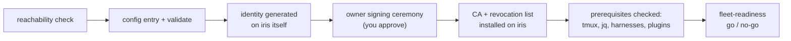
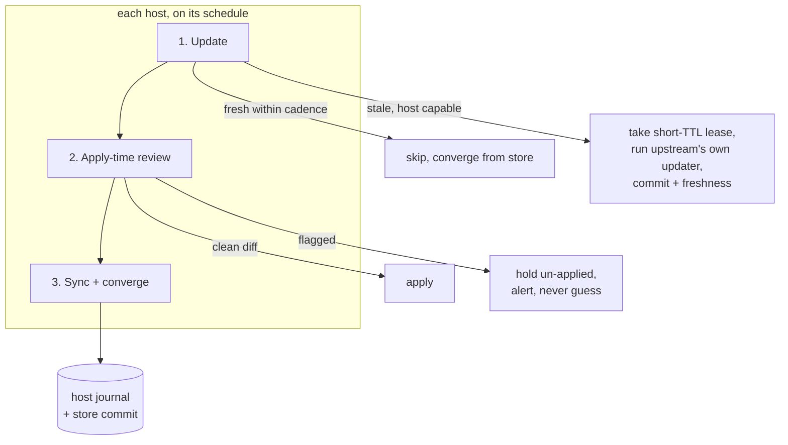

# The fleet's life, end to end

This page follows one fleet from first install to steady state. It's a
small, ordinary setup: **birch**, a laptop; **loom**, a desktop that does
most of the real work; **wharf**, an always-on Mac mini that ends up hosting
a few conveniences precisely because it's always on; and **iris**, a Windows
desktop with a WSL sibling (**iris-wsl**) that exists so agent tooling has a
POSIX shell to run from, even though the work product is native Windows.

Every chapter below is real and running today, except the last — clearly
labeled where it turns into roadmap.

## 1. First machine

You start on `loom`. You say "set up railyard" — or nothing that specific;
railyard's skills route themselves from plain language, so "get this
working here" is enough.

**What happens:** `railyard:setup` runs an inventory first — what harnesses
are installed, what plugins, what's missing — then installs the
prerequisites you approve as a group: the Compound Engineering dependency,
roundhouse itself, agent-utilities, `gh-stack`, `tmux`, `jq`. It checks that
the API keys your installed plugins need are *present*, never their values.
Then it asks the fleet question directly: any other machines? "Just this
one, no config" is a complete, supported answer — you end up with a working
delivery system and nothing configured about hosts you haven't mentioned.

Because roundhouse is installed too, setup also asks — once, a single
paragraph — about desired-state sync. You decline for now. That's fine:
sync is opt-in at every layer, and nothing about it runs, is scheduled, or
touches disk until you later say yes.

**What the operator sees:** a readiness table at the end of setup — one row,
`loom`, ready — and two config files that didn't exist an hour ago:
`~/.config/roundhouse/config.json` (this machine, its transport, its
development root) and whatever harness-native config each installed plugin
needed touched. No `store/` directory yet; that only appears if sync gets
turned on.

**What exists after:** a single machine that can already take "implement X"
end to end — plan, work, review, PR, merge, proof — with no fleet
dependency at all. Adding hosts later doesn't change how `loom` behaves
today; it only adds more places the same request can land.

**Why it's safe:** nothing here required elevated privileges. The API-key
check reads presence, not secrets. The only file writes are to this user's
own config root. There is no daemon started, no scheduled task created, no
network credential provisioned — sync's opt-in gate means setup can ask the
question without any of its machinery existing yet.

## 2. Growing the fleet

A week later you say "add my Windows desktop to the fleet." `iris` isn't
reachable yet from `loom`'s perspective — no SSH identity exists on either
side — so `fleet-hosts` runs the whole enrollment flow, with your consent
requested at each trust-bearing step.

**The SSH ceremony:** the private key for `iris`'s identity is generated *on
`iris`*, never elsewhere — the certificate signing request that leaves the
machine is public-only. You approve the signing step explicitly; that
approval is what turns "a machine claiming to be iris" into "a machine the
fleet's CA has actually vouched for." The CA and the current revocation
list (KRL) are installed on `iris` as part of the same flow.

**Pair capture for Windows/WSL:** `iris` gets registered as a Windows
machine, `wsl: true` on its `iris-wsl` sibling entry, and both carry the
same `physical_host` so the fleet knows they're one box with two shells.
That's what lets later maintenance run Windows-native commands *from* the
WSL side — `cd /mnt/c`, then a full-path `cmd.exe /c "..."` — instead of
needing an interactive Windows session for every routine check. The Windows
process that runs never knows WSL was involved; it operates on Windows
paths, gets Windows-side environment variables, and produces native
evidence.

**Prerequisites:** before `iris` is declared ready, the flow checks for
`tmux`, `jq`, the harnesses you use, and their plugins — on the target, not
assumed. Anything missing is either installed on consent or reported as a
blocker.

**Readiness go/no-go:** the flow ends with `fleet-readiness` actually
evaluating the new host — not "enrollment succeeded, therefore ready," a
real check against current state. `iris` comes back ready; `iris-wsl`
inherits reachability from the pairing but is checked independently for its
own prerequisites.

**Removal, for completeness:** taking a machine out of the fleet runs in the
opposite safe order — clean up over SSH *while access still works*, then
revoke that host's certificate and push the updated revocation list to
every remaining host, then drop the config entry. Revoking first would
strand you mid-cleanup on a host you can no longer reach.

**Why it's safe:** every private key stays where it was born. The
certificate that grants trust is signed only after a human says yes. No
mutation happens on `iris` before its own prerequisites are confirmed
present. And the WSL pairing is declarative metadata, not a shortcut around
Windows security boundaries — the commands that run still run as native
Windows processes under the identity `iris` enrolled with.

## 3. The daily loop

You turn sync on a few weeks in — the fleet's grown enough that "did I
update roundhouse everywhere" stopped being a question you wanted to answer
by hand. `railyard:setup` (or a direct "turn on fleet sync") scaffolds
`~/.config/roundhouse/store/` on `loom` as a jj repository colocated with
git, creates or verifies a private remote with an explicit visibility
check, and absorbs the existing machine registry from `config.json` into
the store's `main` branch. Each host provisions its own scoped store
credential when it joins.

From here, one scheduled entry per host — twice daily, jittered, plus
"sync now" on demand — drives three phases, in order, under a local
run-lock so two runs on one host can never race each other.

**Phase 1 — update, once per fleet, not per machine.** Freshness per
upstream lives on `main`. When `loom` wakes up for its scheduled run and
finds a plugin marketplace stale beyond its cadence, it takes an
opportunistic short-TTL lease — a marker committed to `main`; if `wharf`
grabs it first, that's a lost race, not a failure, and `loom` just skips.
The leaseholder runs the upstream's own update mechanism and commits the
result plus a fresh timestamp. File-carried surfaces (skills, agents,
hooks, config keys) get their updated content committed straight to the
store — every *other* host just replicates it, no upstream contact needed.

Manager-installed items (plugins) work differently: the store carries the
version *pin*, and each host installs that pin locally through its own
plugin manager. Roundhouse's own plugin updates last, and only on the
leaseholding host — its new pin doesn't reach the rest of the fleet until
that host's next run journals healthy. A bad release of the sync machinery
lands on one host, not four.

Codex adds one wrinkle to that pin story. It never runs `git fetch`
against a local-checkout marketplace on its own — keeping that checkout
current is sync's job. Once the checkout is current, though, Codex quietly
advances its own installed plugin versions on the next plugin listing;
sync doesn't need to force a reinstall for that part.

**Phase 2 — apply-time review, on every host, every source.** This is the
phase that matters most. Before anything changed gets materialized or
installed, the *applying* host — not the machine that happened to fetch it
from upstream — diffs current against incoming and reads it. Changes,
including breaking ones, are expected and fine. What gets held is new
deletion behavior, credential or secret access, exfiltration shapes, hook
payload changes — and, just as firmly, **any content addressed to the
reviewer**: text inside a diff claiming it was already approved, urging the
review along, or asserting authority it doesn't have. A diff arguing for
its own approval is itself the hold trigger. If `birch` picks up a skill
update that `wharf` fetched from upstream twelve hours earlier, `birch`
still reviews it fresh before applying it locally — the review happens
where the content is about to run, not just once at the fetch point.
Nothing is ever silently applied and nothing is ever silently forgotten: a
held item is a durable record, and `railyard:doctor` tracks it until
someone resolves it.

**Canary gating adds a second brake beyond review.** When
`sync.canary_group` is set, only members of that group adopt a changed
item right away; every other host waits for a canary's journal to record
a healthy run carrying that item at the exact same content digest, held
for `sync.canary_wait_hours` (24 by default). There's no per-host bypass —
widening who counts as canary is a registry change, visible to the whole
fleet.

**Phase 3 — converge and propose.** Each host aligns to its effective
desired set: union of the groups and scopes that apply to it, with
machine-level settings beating group-level ones whenever they conflict.
Removals propagate by default — absent from desired state means removed,
and every removal is reported by name, never silently. The host's full
snapshot commits to its own `host/<name>` branch (single-writer, enforced
by commit signatures, so `iris`'s branch can never be written by anything
but `iris`).

Those signatures check against each host's own
`allowed_signers` file, derived from its CA enrollment material and
regenerated with `roundhouse sync-refresh-signers` whenever that identity
changes; a revocation lands in the KRL that every verification reads
fresh, so a compromised key stops verifying immediately, no re-sync
required.

If a host makes a genuine local decision — you installed
something by hand on `birch` — that becomes an outward proposal at the
*narrowest* scope: just `birch`, never auto-widened to "all Macs" without
separate cross-host evidence.

**What gets journaled:** every run's what-and-why lands in the host
journal and, via jj's operation log, is individually undoable — reverting
one bad run doesn't disturb three unrelated good ones that happened after
it.

**How conflicts hold rather than guess:** when two hosts touch the same
item in ways that disagree, jj records it as a real conflict commit
instead of silently picking a winner or wedging the working copy.
Convergence never materializes a conflicted item — it keeps serving the
last conflict-free state, holds that one item, and lets the rest of the run
proceed normally. `iris`, being interactive-session-only (logged-off
Windows can't produce activation evidence, and logoff kills `iris-wsl` too),
is *expected* to run stale sometimes — doctor names that explicitly rather
than treating it as a failure indistinguishable from a genuinely broken
host.

## 4. When things change

A month in, `birch` and `loom` both touched the same shared skill config
key within a day of each other — one from an upstream update, one from you
editing it by hand on `birch` before a flight.

**Intent resolution** weighs evidence in a fixed order, and timestamps are
never the decision by themselves:

1. **Store history** — who changed what, on which host, in which run.
2. **Provenance** — an upstream-driven change isn't a human decision; your
   hand-edit on `birch` is.
3. **Redacted transcript findings** — each host mines its *own* session
   transcripts locally (last ~48 hours, extensible) and contributes only
   redacted findings — item, verdict, a bounded quote, no secrets — as
   records on `main`. Resolution happens from those findings anywhere in
   the fleet; the raw transcripts themselves never leave the host that
   produced them.

Confident evidence resolves the conflict at the scope the evidence actually
supports — fleet-wide only when the evidence is fleet-wide. Ambiguous
evidence **holds the divergence and alerts**, and waits for you. It never
resolves destructively on a guess, and a long-offline host whose evidence
window has already lapsed defaults to hold for the same reason.

**Holds and alerts:** an alert is three things at once — a durable record
on `main`, a line in the host journal, and, when someone's actually at a
keyboard, a native OS notification. Any interactive session on any host
surfaces *fleet-wide* pending items, not just its own, so opening a
terminal on `wharf` can be how you find out `iris` has something waiting.
`railyard:doctor` is the scheduled backstop for anything nobody happened to
see live — pending items past a threshold escalate in its report.

**Rollback and the restore sequence:** undoing one bad sync run is a jj
operation-log revert, scoped to that run alone. Restoring a whole machine —
say `loom`'s disk dies — is honestly scoped as **configs plus a shopping
list**, sequenced:

1. Re-enroll `loom` through `fleet-hosts` (a fresh SSH ceremony — the old
   identity is gone with the disk).
2. Provision a new store credential for the re-enrolled host.
3. Materialize every file-carried surface from `host/loom`'s last known
   snapshot.
4. Replay manager installs (plugins) from that same snapshot's inventory.
5. Work the auth shopping list — per-artifact reauth the store was never
   allowed to carry for you, because it never stored a secret in the first
   place.

Read-first, every time: the full delta is shown before anything touches
disk.

## 5. Delivery on top

None of the above is the point by itself — it's what makes the delivery
side trustworthy. When you tell railyard "implement the retry logic and
ship it" with a multi-machine fleet behind you, `orchestrate` consults
`fleet-readiness` before it ever creates a task on a destination host.
Roundhouse doesn't decide *what* work runs where — that's railyard's job —
but railyard never dispatches to a host roundhouse hasn't actually
verified.

For `iris`, that verification includes the WSL-as-launcher lane: a harness
that can't drive Windows's interactive task surface directly (Claude Code,
today) isn't blocked from the declarative half of getting a machine ready —
config, marketplace desired-records, profile bundles can all stage onto
`iris` through the signed `windows-sftp` lane over SSH, picked up by a
broker task within a minute, even while nobody's logged into `iris` at all.
The parts that genuinely need an interactive Windows session — installing
a plugin cache, re-approving hook trust — wait for one, and are reported as
waiting rather than faked.

**Model-routing discipline** rides along on every dispatch: an explicit
model and effort decision is recorded for each unit of work handed to a
carrier, rather than each session improvising its own choice. Cross-harness
dispatch — a Claude session handing work to a Codex carrier, or the
reverse — only happens when you've opted into it; it is never a silent
default one harness falls back to when its own capacity is tight. That
discipline is what makes "run this across my machines" safe to say without
having to separately audit which model did which piece afterward.

## 6. The road ahead: unattended privileged updates

Everything above ships today. This chapter doesn't — it's the design for
where privileged updates go next, kept clearly separate because it changes
the trust story and deserves scrutiny before it exists, not after.

**Today:** when a scheduled run hits a package that needs `sudo` or
Administrator — an `apt` upgrade, a Homebrew cask that reaches system
paths, a machine-scope `winget` package — it stops and stays interactive on
purpose. You're prompted, you approve, the broker's sealed-plan pipeline
carries it out. Nothing privileged has ever run on this fleet without a
human saying yes at the moment it happened.

**The design:** let a scheduled run apply *some* of that privileged work
with nobody watching — but replace "a human approved this at run time" with
mechanisms that are arguably stricter, not looser:

- **Two flags, both required, fail closed.** An action (say, "apply an apt
  upgrade") needs an owner-activated `unattended` gate at the catalog level
  *and* the specific binding — this package, from this channel — needs its
  own `unattended` grant. "All apt packages" and "this one third-party cask
  stays attended forever" are both expressible; the flags only ever narrow
  when something may run, never what it's allowed to do.
- **Provenance-anchored trust, not byte-pinning.** Today, an
  auto-updating app needs a human to re-approve its exact bytes on every
  release — which defeats the point of unattended anything. The design
  replaces that with binding the update to *where it came from*: `apt` and
  `winget` already anchor to root-owned source state; Homebrew casks get a
  new root-owned attested snapshot of the tap so the check never has to
  trust the user-writable checkout; direct signed installers outside any
  package manager get checked against Apple's actual code-signing chain —
  Team ID, notarization, a bounded-staleness revocation check that fails
  closed on "no network, no answer" rather than passing through. Anything
  that can't be anchored to a provenance one of those three ways — a
  one-off binary with no manager and no signature — stays attended by
  design, and that's meant to be a nudge toward putting it in a manager.
- **Anti-rollback, always.** No unattended binding can ever apply a version
  *older* than what's installed. Downgrades stay a deliberate, attended
  act.
- **Canary gating.** Each OS family gets a canary host in the registry. A
  non-canary machine only applies a given (channel, package, version) once
  the canary's own journaled success for that exact tuple has sat clean in
  the store for a set number of hours; a canary *failure* holds that tuple
  fleet-wide, automatically.
- **A hard per-run cap.** An unattended run applies at most a handful of
  privileged changes before it stops and holds the rest for review. A
  normal night touching two or three packages is normal; fifty in one run
  is an anomaly regardless of how trustworthy each individually looks.
- **Definition-diff screening.** Before an unattended Homebrew apply, the
  cask or formula definition itself gets diffed against the last known-good
  snapshot — a new URL host, a checksum weakening to unverified, a new
  install script — any of which holds the item attended, because that
  diff is cheap to read and it's exactly the kind of change a compromised
  upstream would make.
- **Ceremonies mint authority; sessions only propose.** Installing
  something through a managed channel stages a *binding proposal* — it
  never touches policy by itself. Only a batched, owner-confirmed ceremony
  actually commits a proposal into root-owned policy. A compromised or
  confused session can generate noise to review; it can never grant itself
  privileged standing.

The honest summary: unattended privileged updates, when they ship, will
mean fewer approval prompts for `loom`, `birch`, `wharf`, and `iris` — not
less scrutiny of what gets root. Until then, that scrutiny is a human, at
the moment it matters, every time.

## Go deeper

- **[The value proposition](index.md)**
- **[Where this fits next to what you already know](comparison.md)**
- **[Configuration reference](config.md)**
- **[Skills index](skills/)**
