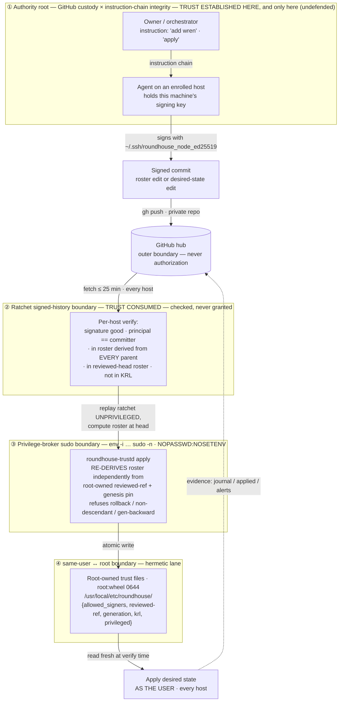

# Threat model — fleet desired-state sync and trust

**Scope.** The roundhouse fleet store, its trust ratchet, and the local
materialization lane (`roundhouse-trustd`) that gives root ownership meaning. This
document is written for external review. It describes the system as it is shipped,
names the boundaries it defends, and states the residuals it does not — plainly and
without hedging, because a trust model that hides its floor is worse than one that
names it.

**Audience note.** This is a single-operator fleet with no human-held secret, no
certificate authority, and no authority key. Every design decision below follows
from those constraints. Where a residual is structural rather than a bug, it is
marked as such and the reason it cannot be closed within the constraints is given.

---

## 1. System model and assets

**What the store is.** The fleet store is a private [jj](../why-jj.md) repository of
hand-editable YAML. Every machine in the fleet holds a complete clone; there are no
primaries. The YAML describes each machine's desired agent surface — packages,
settings, plugins, skills, projects, startup tasks — and **its content executes as
the invoking user on every host that applies it.** This is the central fact of the
model: the store is not passive configuration data, it is code that runs with the
owner's privileges on every machine. A change that lands in the store and verifies is
a change that runs. The trust model exists to decide *which* changes verify.

**Asset — fleet store integrity.** The property that a machine applies only desired
state authored by a key the fleet currently trusts, ordered by a hash-secured
history. This is the primary asset. Compromising it means running attacker-chosen
code as the user on one or more hosts. Every gate in this document defends this asset
directly or bounds the blast radius of its loss.

**Asset — per-machine signing keys.** Each host holds one Ed25519 key at
`~/.ssh/roundhouse_node_ed25519`. It signs that host's commits and is the sole thing
that makes a write count. The key must be readable by the process that signs, so it
is same-user readable by construction: **whoever holds a host's shell holds its
signing key.** Losing a key is losing one machine; the model is built so that this
costs one revocation, not a fleet outage.

**Asset — the roster and trust state.** `trust/signers.yaml` (the roster) plus the
per-host high-water marks (`reviewed-ref`, `generation`) and the key-revocation list
(KRL). The roster decides membership; the high-water marks defend against rollback;
the KRL burns history. These are the state that says who may write. Their integrity
is defended in the store by the ratchet, and locally by root ownership where the
privileged lane is configured.

**Asset — the GitHub account.** The store is a private repo. Only the owner's GitHub
credential can create, find, clone, or push it. This is the outer boundary on who
participates at all. It is deliberately *not* an authorization: pushing to the hub
does not enrol anyone, because every commit is signature-gated. A stolen hub
credential yields disclosure plus bounded rollback and denial-of-service attempts,
never the ability to write desired state.

---

## 2. Security boundaries and trust flow

The diagram shows the four boundaries and the path a change travels: an authoring
agent signs a commit, pushes it to the hub, and every host independently fetches,
verifies, materializes, and applies. Trust is **established** in exactly one place
(the authority root) and **consumed** — checked, never granted — everywhere else.



Read the diagram as four nested claims:

- **① is the only place trust originates**, and it is undefended by design (§3b).
- **② is where trust is spent**: every host re-checks every commit against history it
  already possesses. Nothing new is trusted here; commits are admitted or held.
- **③ crosses the user→root privilege line** exactly once, through a hermetic
  invocation that carries no attacker-controllable input.
- **④ is what root ownership buys**: the local trust files a host reads at verify time
  are root-owned, so an attacker holding the signing key cannot make their key
  *survive* a fleet revocation.

---

## 3. Trust boundaries, drawn explicitly

### 3a. The ratchet — the signed-history boundary

**What it protects.** Fleet store integrity. It decides, per commit, whether a write
counts.

**How trust crosses it.** A commit `C` signed by principal `P` is accepted if and only
if all hold: (1) the signature status is `good` — `unknown` is failure, always, with
no provisional acceptance; (2) the signature's display identity equals the committer
email — the principal-equals-committer gate; (3) `P` is in the roster materialized
from **every one of `C`'s parents** — additions gate forward; (4) `P` is in the roster
materialized from **this host's current reviewed head** — removals bite backward; (5)
`P` is not in the host-local KRL; (6) `P`'s class, read from the same every-parent
roster, permits the paths `C` touches.

The load-bearing rule is that **a roster or content change counts only if signed by a
key the roster already trusted one commit earlier.** Reading the roster at the current
head is circular — the file being verified would supply its own verification keys, so
an attacker who lands one commit replacing the whole roster passes. Evaluating at the
**parent** reads a strictly earlier point in a hash-secured history and is not
circular. "Every parent," not "the parent," is deliberate: the naive `-r <C>-` picks
one parent of a merge, and merges are a normal path — the singular reading lets a
removed member keep pushing by parenting commits before their own removal. The
intersection of all parents is the safe direction and costs legitimate authors
nothing, because the ancestry property guarantees a newcomer clones only after its
enrollment is on `main@origin`, so every head it can merge already descends from that
enrollment.

**What defeats it.** Nothing within the cryptography — the ratchet does exactly what it
claims. It is defeated only by defeating the authority root above it (§3b): a
correctly-executed malicious instruction produces commits that verify. It is also
subject to the rollback residual (§6.3) against a host that has been offline since
before a revocation.

### 3b. The authority root — GitHub custody and instruction-chain integrity

**What it protects.** Nothing protects this boundary; it is the boundary everything
else rests on. Stated plainly:

> **Authority = custody of the owner's GitHub account × integrity of the instruction
> chain.** There is no human-held secret, no fingerprint glance, no verification step
> anywhere in this design. What authorizes enrolling a machine is that some agent
> session that was told to do it executed the enrollment with credentials it already
> holds.

**How trust crosses it.** Two things, and only two. (1) **GitHub account custody** —
the store is a private repo; only the owner's credential can create, find, clone, or
push it. (2) **Instruction-chain integrity** — whichever session was told "set up the
fleet" or "add wren" carries the authority, whether the instruction came from the
owner typing it or an orchestrator relaying it.

**What defeats it.** A prompt-injected agent session, or a compromised orchestrator,
that issues "add attacker-box." The model executes it correctly: every signature
verifies, every gate passes, the ratchet works as designed. **The store cannot
distinguish a correctly-executed instruction from a correctly-executed instruction.**
The trust model secures the wire, not the intent. There is **no technical detection**
of this — only containment: a loud roster-change alert on every host within one fast
interval, the soak window during which a freshly enrolled key can write nothing but
its own inert evidence, and one-instruction in-band revocation. This is the largest
residual (§6.1) and it is structural.

### 3c. The same-user ↔ root boundary — trustd's hermetic lane

**What it protects.** Persistence past revocation, and only that. The local trust files
a host reads at verify time — the roster (`allowed_signers`), `reviewed-ref`,
`generation`, KRL — are root-owned (`root:wheel 0644`) where the privileged lane is
configured, written only by `roundhouse-trustd`. An attacker holding this host's
signing key can locally truncate the KRL or edit a same-user roster to un-revoke their
own key after the fleet has revoked it; because trustd re-writes those files root-owned
on the next apply, **the un-revocation does not survive.**

This boundary defends **persistence, not entry.** It is stated honestly: an attacker
with the user's shell already holds `~/.ssh/roundhouse_node_ed25519` and *is* this
machine — they do not need to self-enrol. Root ownership does not prevent that. It
prevents something narrower and genuinely valuable: revoke the compromised host, and
with a root-owned roster the attacker's locally-appended key never existed anywhere
else and this host's own copy is corrected on the next `trustd apply`. With a
user-owned roster, the revoked host keeps trusting the attacker — and that host is
exactly the one you were cutting off.

**How trust crosses it.** trustd runs as root but **trusts none of its same-user
arguments.** Its only trusted inputs are the signed jj history and the genesis pin. It
re-derives the roster the way the read path does — replaying the ratchet from its own
**root-owned** `reviewed-ref` (or the genesis pin, on first apply) up to the adopted
revision, holding any commit that does not verify against the roster at its own
parents. A working-copy roster edit signed by a key the parent did not trust never
materializes. A rewound head fails the descendant and generation gates, because those
high-water marks are root-owned and the attacker cannot move them. The invocation is
hermetic:

```
env -i PATH=/usr/sbin:/usr/bin:/sbin:/bin LC_ALL=C LANG=C TZ=UTC SSH_AUTH_SOCK= \
    /usr/bin/sudo -n <helper> apply <store> <rev>
```

`env -i` drops the caller's entire environment; the `NOPASSWD:NOSETENV` sudoers entry
prevents re-adding any variable via `sudo VAR=x`. Inside the root process, trustd
defends itself independently and redundantly: when root it **ignores**
`ROUNDHOUSE_TRUSTD_HOME` (honored only under the unprivileged self-check), **refuses to
source** any `roundhouse`/`lib/`/`lib/*.sh` that is not root-owned, **replaces** PATH
with the four root-owned system directories rather than appending the caller's, and
resolves `jj`/`yq`/`jq` to absolute paths from a root-owned toolchain manifest, each
re-verified root-owned and executable at use. The two layers — hermetic invocation and
in-process self-defence — fail independently.

This lane is installed once, root-owned, via the same consented privileged step that
installs the POSIX privilege broker (§3d) — that step's own explicit per-host consent,
separate from and never implied by the single setup consent for ordinary plugin
installs. It roots a single prefix holding the binary,
the library tree it sources, and the pinned toolchain. Ownership of the whole prefix is
load-bearing — a same-user-writable trustd is trustd defeated — so `fleet-doctor`
asserts the whole prefix's ownership, not just the binary.

**What defeats it.** An attacker who *already holds root* (this boundary is below root
by definition), or an environment where root ownership collapses to same-user:
passwordless sudo, or a platform where the trust prefix's ancestors are user-owned. On
Intel Homebrew where `/usr/local` is user-owned, the install lane **fails closed**
(`prefix_layout_failed`) rather than rooting under a user-writable parent. Where the
lane is genuinely unavailable, the model degrades to same-user custody and says so
(§6.6).

### 3d. The privilege-broker sudo boundary

**What it protects.** The user→root privilege line. It is the single place in the
unattended run where code crosses from same-user to root, and it is the surface an
earlier review flagged as the one local-root-RCE risk. That review's P0 (root RCE via
unsanitized environment plus an un-rooted sourced library/toolchain) is closed; the
re-review verdict is ship, with no P0 or P1 remaining.

**How trust crosses it.** Only through `env -i … sudo -n`, with the store path and
revision as the sole arguments and a fixed minimal environment. The sudoers entry is
`NOPASSWD:NOSETENV`. The install lane that writes this entry is itself root-gated,
never in the unattended path; the target username is validated against
`^[A-Za-z0-9][A-Za-z0-9._:-]{0,127}$` (no space or newline, so no sudoers injection)
and the rendered entry is `visudo -cf`-validated before install.

This broker install is a **separate, explicit, per-host consent** — its own trust
decision naming the exact host. It is deliberately *not* covered by the single setup
consent that authorizes ordinary plugin installs (railyard, roundhouse,
agent-utilities, Compound Engineering, ponytail): that streamlining only stops the
setup flow from asking repeatedly for the same ordinary plugin installs, and it never
reaches a privileged lane. Installing railyard, or consenting to setup, does not
authorize this broker, SSH-certificate signing/enrollment, or the trustd install — each
remains its own explicit step. A reviewer must read no auto-authorization of a
privileged lane from the setup consent.

**What defeats it.** Root already held; or a compromise of the one-time consented
install step, which copies the source tree from the user-owned plugin directory — this
is the install-time trust the design names explicitly (§6.7), not a post-enrollment
vector. Scratch is pinned under the root-owned trust prefix when root, and `TMPDIR` is
unused when root, closing the environment-into-root scratch vectors.

---

## 4. Trust levels and principals

| Principal | May do | May not do |
|---|---|---|
| **Durable member** | Write fleet-shared layers (`fleet/`, `os/`, `groups/`, `hosts/`, `definitions.yaml`, `lineage/`, `proposals/`); write its own host-keyed paths; **sponsor** either class (edit `trust/signers.yaml`); checkpoint and re-root | Write another member's host-keyed paths |
| **Ephemeral / leaf member** | Write only its own host-keyed evidence paths (`journal/<self>/`, `applied/<self>.yaml`, `alerts/<self>/`, `findings/<self>/`) | Write **any** fleet-shared layer; **sponsor** — a leaf can never enrol another key; write another member's paths. This is the whole anti-explosion rule: a 40-container burst is 40 leaves at depth 1 under one durable sponsor, one hop of custody always |
| **Non-member** | Nothing. An `unknown`-signed commit (e.g. a `joins/` request) is inert — read as a hint, never applied | Write anything that verifies. `unknown` is failure, deliberately indistinguishable from an attacker |
| **Same-user attacker holding a host's key** | Everything that host can do — it **is** that host: write as the host, self-enrol a new key (ratchet-valid, since the host was trusted at the parent), sign malicious desired state | Nothing *additional* by self-enrolling — enrolment gave it no power it lacked. Persist **past revocation** where the root-owned trust lane is configured: on the next apply, trustd corrects the locally-tampered roster/KRL |
| **root** | Everything on that host, including the trust files trustd owns | Nothing constrains root locally. Root on one host is still bounded at the fleet layer by the ratchet — it cannot forge a signature for a key it does not hold, so it cannot author a commit other hosts will accept as another principal |

Membership **class is the security boundary, not the TTL.** The class is the section of
the roster a key sits in, and putting it there was itself a ratchet-valid act by a
durable member — it is never self-asserted. A member cannot promote its own class or
shorten its own soak window, for the same structural reason: doing so is a roster
change, itself subject to the ratchet, landing in a later commit whose effect the
parents of its earlier commits do not carry.

---

## 5. Threat actor × capability matrix

Each cell cites the mechanism that grants (✓) or denies (✗) the capability. "Read
store" is disclosure of fleet config; "write desired state" is the primary asset;
"persist past revocation" is what the root-owned lane defends.

| Actor | Read store | Write desired state | Enrol a key | Persist past revocation | Forge history | Escalate to root |
|---|---|---|---|---|---|---|
| **External network** (no key, no hub credential) | ✗ private repo, hub credential required | ✗ signature gate | ✗ ratchet: no trusted key | ✗ | ✗ hash-secured DAG | ✗ |
| **Malicious enrolled member** (durable) | ✓ is a member | ✓ **can, and no model prevents it** — a member who can write can write malice (§7.12.1); bounded by apply-time review, canary, removal caps, soak, alert | ✓ ratchet-valid (trusted at parent) — but enrolment gives nothing the member's own key lacked | ✓ until revoked; revocation is one edit, ≤25 min, in-band | ✗ ratchet + monotonic `reviewed-ref`/`generation` | ✗ no local privilege from membership |
| **Stolen machine key** (leaf) | ✓ a clone is a complete peer | Own evidence paths only ✗ fleet layers — class refusal, rule 6 | ✗ leaves cannot sponsor | ✓ until revoked; blast radius **one machine**, old commits stay good | ✗ | ✗ |
| **Same-user attacker holding a host's key** | ✓ holds the clone | ✓ **is** that host — writes as it, and `~/.ssh/roundhouse_node_ed25519` is same-user readable by construction | ✓ ratchet-valid, but redundant — already this machine | **✗ where the root-owned lane is configured** — trustd re-derives root-owned trust files, correcting local un-revocation (§3c); ✓ on the degraded same-user rung | ✗ high-water marks root-owned, cannot be rewound | ✗ trustd trusts none of its same-user arguments; hermetic invocation (§3d) |
| **Compromised orchestrator / prompt-injection** | ✓ instructs an enrolled agent | ✓ **the largest residual** — a correctly-executed instruction is indistinguishable from an owner's; every signature verifies (§3b, §6.1) | ✓ issues "add attacker-box"; enrolment succeeds and verifies | ✓ until the operator notices the alert and revokes | ✗ still bounded by the ratchet's ordering rules | ✗ no direct local root, but authors code that runs as the user on apply |
| **Hub / GitHub compromise** | ✓ can clone and read | ✗ **every commit is signature-gated** — cannot write desired state (§7.12.5) | ✗ hub push alone never enrols; `joins/` is inert | Rollback/DoS attempts only, bounded by monotonic `generation` + archive protocol | ✗ can force-push, but stale heads are rejected as non-descendants | ✗ |

The two rows that admit ✓ on "write desired state" — the malicious member and the
compromised instruction chain — are the same underlying fact stated at two altitudes:
**any model where a member can write is a model where a compromised member can write.**
The controls for both sit downstream (review, canary, caps) and in containment (alert,
soak, revocation), never in a cryptographic denial that cannot exist.

---

## 6. Residuals — stated unhedged

A trust model that hides its floor is worse than one that names it. Each residual below
gives its **exposure**, its **bound**, and **what would close it**.

### 6.1 Instruction-chain compromise (the largest, structural)

**Exposure.** A prompt-injected agent session, or a compromised orchestrator, can issue
"add attacker-box" and the entire model executes it correctly. Every signature
verifies, every gate passes, the ratchet is working as designed. The store cannot
distinguish a correctly-executed instruction from a correctly-executed instruction.
There is **no technical detection**.

**Bound.** Containment only: the roster-change alert on every host within one fast
interval (a two-to-three-times-a-year event on a small fleet — if it fires and nobody
asked for a machine, that is the compromise notification); the soak, during which the
new key can write nothing but its own inert evidence; and one-instruction in-band
revocation. Blast radius is further bounded downstream by apply-time review, the held
`hooks` category, the canary gate, and removal caps.

**What would close it.** Nothing within the design's constraints. It is authority
reduced to two dependencies — GitHub account custody and the integrity of whatever
session was told to do the work — and everything else in the model is blast-radius
engineering on top of those two. Closing it requires a trust anchor outside the
instruction chain (a human verification step or a hardware root), which the zero-touch,
single-operator constraint forbids.

### 6.2 Trust-on-first-use (TOFU) at genuine first contact

**Exposure.** Enrollment reaches a newcomer over SSH. On genuine first contact, where
the host key is truly unknown, an attacker positioned between the sponsor and whatever
the name resolves to can answer instead, and the sponsor bootstraps the attacker's
machine under the newcomer's principal.

**Bound.** The attacker gains a fleet-writer key — not entry to any existing host, not
the owner's SSH private key, not the hub credential. `channel_auth: tofu` selects the
**72-hour soak** rather than 24 hours, so the weakest path is visibly the slowest; a
distinct alert class fires on every host naming `tofu`; revocation is one instruction.
Decisively, the real machine never joins and a human just asked for it to — this is the
most-noticed attack in the system, in contrast to every other, which is silent by
design.

**What would close it.** A human check or a pre-shared secret, both forbidden by the
zero-touch requirement. Opportunistically shrunk to nothing where `known_hosts` (the
owner has SSH'd there before) or a tailnet address (the tunnel authenticates the node)
applies — both reads of data the fleet already carries.

### 6.3 Rollback against an offline or restored-from-backup host

**Exposure.** An attacker with hub write access force-pushes a history truncated to
before a revocation. A host that has been offline since before that revocation, or
restored from an old backup, **accepts** it.

**Bound.** A host already past the revocation rejects it — `reviewed-ref` is monotonic,
so the fetched head is not a descendant: alert and hold. A host behind but which saw
the newer roster rejects it — `generation` is below its last-seen value. Only the
genuinely-stale host accepts, and even then the attacker needs a key that was valid at
the rollback point, so **they already had write access — this buys persistence, not
entry.** The moment that host talks to any current host or the real hub, the generation
check fires. A legitimate re-root is distinguished from this attack solely by the
mandatory archive ref (§7.11.2).

**What would close it.** An external witness — a trusted third party attesting the
current generation. The self-contained constraint forbids it, so no in-band fix exists.

### 6.4 Backdating within the parent's timestamp

**Exposure.** Window arithmetic (soak, TTL) is evaluated against each commit's own
timestamp, which the author controls within the bound set by the parent's roster
values.

**Bound.** The generation monotonicity assert, and the fact that a forged expired leaf
can write nothing but its own inert evidence. A member cannot backdate its own
`enrolled_at` to shorten its soak, because that edit is a roster change subject to the
ratchet and lands in a later commit — the parents of its earlier commits still carry
the original value. **TTL is hygiene; the class is the boundary.**

**What would close it.** A trusted external clock or timestamping authority — again
forbidden by the self-contained constraint. Not pursued, because the class boundary
already contains the consequence.

### 6.5 KRL propagation window

**Exposure.** The KRL is host-local, read fresh per verification. Burning a key's
history via a KRL entry takes effect on a given host only once the updated KRL reaches
that host. Until then, that host still treats the burned key's commits as `good`.

**Bound.** In-chain revocation (moving a key to `retired:`) propagates on the ordinary
fetch cadence, ≤25 minutes, and is the default. The KRL is used **additionally** and
only to deliberately burn history, and its first-run custody is closed — trustd refuses
to root a same-user KRL, seeding the root-owned KRL from the enrollment-time source
instead, so an attacker cannot freeze an empty KRL before trustd first roots it.

**What would close it.** Out-of-band KRL fan-out to every host at burn time, which the
operator performs when a burn is genuinely needed. The window is the ordinary
distributed-revocation lag, not a defect.

### 6.6 Forced degrade to same-user custody at runtime

**Exposure.** If an attacker unlinks the installed trustd binary or removes its execute
bit, `fleet_trust_privileged` returns false and `fleet_trust_materialize` takes the
same-user branch at runtime. The window between that forced degrade and the operator
next running `fleet-doctor` runs on same-user custody, re-enabling persistence past
revocation on that host.

**Bound.** The existing root-owned trust state is untampered — it lives in a root-owned
directory the same-user attacker cannot write. The degrade is **loudly flagged**: on
every root apply trustd writes a root-owned `<TRUST>/privileged` marker in the
root-owned trust prefix. A same-user attacker who unlinks the binary to force the
downgrade cannot delete that marker, so `fleet-doctor` sees a marker present with no
lane and reports a **finding** — distinguishing a host forced back to same-user custody
from one that never had a lane (which stays cleanly OK). Armed-lane failures already
fail closed: a nonzero `sudo`/trustd exit returns 65 (hold), never a silent
fall-through.

**Why runtime-fail-closed was not chosen.** The available hardening is to have
`fleet_trust_materialize` consult the root-owned marker and fail closed — hold, exit 65
— whenever the marker exists but no lane does, converting detection into runtime
prevention. It was **not** taken because it creates a worse failure mode than the one
it closes: an operator who legitimately uninstalls the trustd lane would leave the
marker behind and **lock every subsequent run out of that host**, a self-inflicted
denial of service on an ordinary administrative action. The design chooses tamper-proof
**detection within one doctor run** over runtime prevention that turns operator
uninstall into a false lockout. The marker is root-owned in a root-owned directory, so
its detection cannot be forged or suppressed by the same-user attacker it targets.

### 6.7 Install-time toolchain snapshot

**Exposure.** The install lane copies the first `jj`/`yq`/`jq` found under the standard
prefixes and roots them. On Intel Homebrew, where `/usr/local/bin` is user-owned, a
user-owned `jj` present at consent time is rooted as-is.

**Bound.** This is install-time trust — the one-time, root-gated, consented step, not a
post-enrollment escalation. The copy roots a regular file, re-verified root-owned and
executable at each use. The prefix layout itself fails closed on Intel rather than
rooting under a user-writable parent.

**What would close it.** Pinning the toolchain to a distribution the operator has
independently verified, or building the tools into the rooted prefix. Not pursued at
this scale; the consent step is the trust boundary and is named as such — the
root-gated privileged consent, distinct from the ordinary setup consent, which never
authorizes this lane.

### 6.8 Availability is out of scope, and the leaf class is the sharpest instance

**Exposure.** Every control in this document fails to `hold`, and a held item is an
unavailable item. Rule 6 refuses an ephemeral leaf's write to a fleet-shared layer at
verification on every host — but **the refused commit still exists in the history every
host fetches.** So the lowest-trust class, instantiated ~40×/day by construction, can
degrade a shared layer for the whole fleet by touching it once, and it stays degraded
until a durable member supersedes the file. The same is true of anyone holding the hub
credential.

**Bound.** Such a commit is signed, attributable to a specific key, visible in the same
alert channel as everything else, and one `retired:` edit from being cut off — and
because leaves cannot sponsor, the population that can do it is exactly the set some
durable member instantiated. For a class refusal specifically, the hold is narrowed to
**only the items whose values that commit actually changed** (computed over the union
of keys on both sides, so removals count), not every item the file contributes — a leaf
can degrade what it touched but can no longer freeze a whole file by brushing against
it.

**What would close it.** Nothing here — this design buys integrity and attribution, not
availability, and a control that fails closed is a control that can be made to fail
closed on purpose. **What is not claimed:** that an authenticated member cannot degrade
availability. It can.

### 6.9 Genesis pin hash strength

**Exposure.** The genesis pin inherits git's commit-hash strength.

**Bound.** Irrelevant at this threat level — an attacker would need a colliding commit
that is *also* ratchet-valid.

**What would close it.** The pin would become `sha256(genesis_commit_id ‖ genesis
roster bytes)` if anyone ever cared. It is a named dependency, not a live weakness.

### 6.10 Store-path symlink components (note only)

**Exposure.** trustd validates the store path is absolute, canonical, a directory, and
contains `.jj`, but does not reject symlinked non-leaf path components.

**Bound.** trustd only ever **reads** the store (`jj -R`), never writes into it, and the
leaf is rejected. Exposure is limited to pointing jj at a root-readable repo — not a
write primitive.

**What would close it.** Rejecting symlinked path components, which would matter only if
the store path ever fed a write. Noted for completeness.

---

## 7. Assumptions and non-goals

**Assumptions.**

- **Single-operator fleet.** One human owner, no shared administration, no second
  party at genesis to fool. The upgrade trigger for the hardening deliberately not
  taken (immutable flags, a separate service account, TPM/Secure Enclave key storage)
  is the arrival of a second human.
- **The store content is trusted to execute, by design.** The store is code that runs
  as the user on every host. The model decides authorship, not safety of content — a
  verified commit runs. This is a property, not an oversight.
- **A complete clone is a complete peer.** There are no primaries; every host verifies
  independently from history it already possesses. Offline hosts are a survivable
  exception, not a special mode.
- **The signing key is same-user readable.** It must be, because the signing process
  reads it. Whoever holds a host's shell holds its key.

**Non-goals — explicitly not defended.**

- **A compromised GitHub account.** It is the outer boundary on participation, not an
  authorization. Its theft yields disclosure plus bounded rollback and DoS, never the
  ability to write desired state — but the model does not attempt to detect or recover
  from account takeover itself.
- **A compromised operator instruction chain.** The single largest residual (§6.1).
  There is no technical detection of a correctly-executed malicious instruction, only
  containment.
- **Physical access.** A host's key, clone, and (on the degraded rung) trust files are
  readable by anyone with the machine. Root ownership raises the bar to persistence,
  not to physical possession.
- **Availability.** Every control fails to `hold`; the design buys integrity and
  attribution (§6.8).

---

## Related

- **[Trust](../trust.md)** — the ratchet and membership, for readers new to the model.
- **[The fleet store](../store.md)** — what lives in the repository.
- **[How a change travels](../convergence.md)** — where these gates sit in a run.
- **[Running it](../operating.md)** — the membership verbs, revocation, and doctor.
